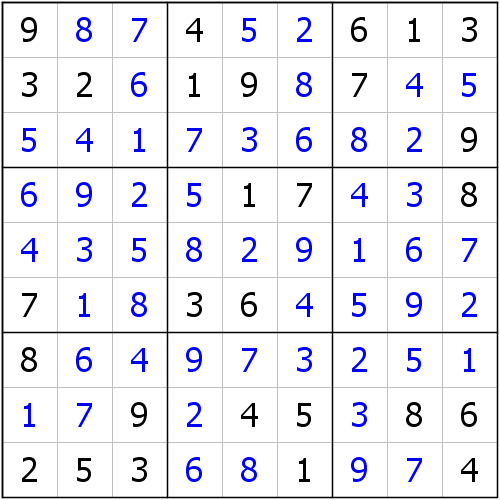
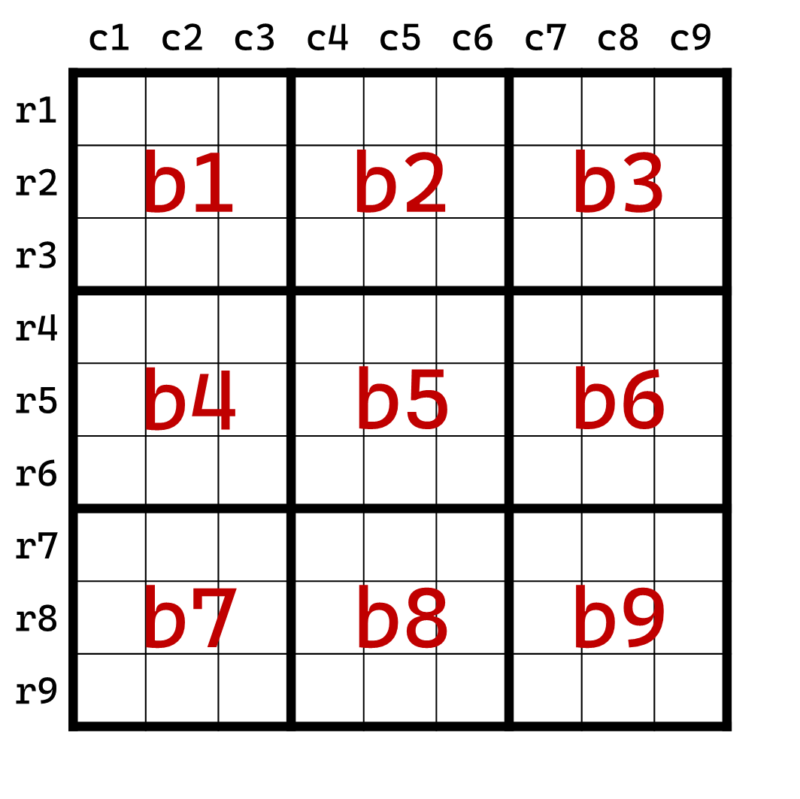

# 第 1 讲：数独介绍

## Part 1 数独基本规则

什么是数独？数独是一种益智游戏，在空格里填入数字1到9，使得每一行、每一列和每一个用粗线围起来的3×3的九个单元格里，填数都包含1到9各一个。换句话说，没有重复的数字出现。比如下面这个答案所给出的样子：

可以从图上看出，每一行、列和粗线围起来的区域（称为**宫**，**Block**），都有9个单元格，并且每一组这样的9个单元格都不含有相同的数字，都是1到9各有一个，不多也不少。这便是数独的规则。规则其实理解起来并不是那么难，对吧。

> 当然，这里提及一点。规则里说明的“1到9各一个”和“不允许重复”两者应当是等价的说法。换句话说，如果“1到9各一个”这一点满足不了，就得有一个数出现不止一次，也就违背了“不允许重复”的条件。所以一般情况下，很多资料叙述的规则只会提及“1到9各一个”和“不允许重复”的其中一点。

不过我们从规则里看不出什么比较有意义和实质性的东西，所以这里需要继续提及一些内容。

### 1-1 解的唯一性

需要注意的是，每一个题目都只有唯一的**解**（**Solution**）。所谓的解，也就是答案。每一个合适的题目都必须拥有唯一的答案。换而言之，每一个空格的填法都只有唯一的一个。但凡拥有某个（或某些）单元格出现多出一种填法的话，都算作多解题，这种题目不是合法的。例如上题，就是一个合格的题目，答案是唯一的；另外，如果一眼就能看到题目所给的数字不满足数独规则，或者是经过一部分推理逻辑得到一些填数并保证这些数字是正确的填入后，此时出现不满足数独规则的情况，那么这种题目叫无解题，即不可能有解的题目。

> 实际上，唯一解的特殊约定并未定义在题目的整体规则之中，但由于多解和无解题无法找寻结果，以及大多数情况下不能完成而没有意义被排斥，所以唯一解的要求依然被我们算作数独规则之中，作为一条“潜规则”，而这条规则叫做**Da Rule**，你完全可以认为这个所谓的Da Rule就指的是唯一解的规则。

如何快速发现题目是多解的呢？目前尚无比较好的办法，要么通过做题经验，要么通过一些经验结论来判断。经验结论将在“致命结构”的技巧部分内详细阐述逻辑及其原理，这里不作过多探讨。

### 1-2 错题

如果在做题过程之中错题了，即发现了行、列和九宫格里出现了重复的数字，这个时候我们怎么去改正呢？一般而言，错题是一件很棘手的事情。只要错题，一般就只有两种解决方案：第一种是通过回忆做题顺序的方式来找到错误所在地方，然后恢复到错误的地方，重新继续完成题目（回溯）。不过这种方法实现起来比较困难，因为回溯需要依赖于记忆做题步骤，而做题步骤太多，才发现错误的话，一般来说都不好解决。我们建议的唯一的方法就是重做此题。

数独是一个很严谨的逻辑推理游戏，如果错题了，还有一种方法，就是通过局部数字置换的方式，将一些数字两两交换，来还原题目。不过这种方法有时候很奏效，但有时候会使得情况变得更糟糕。

### 1-3 教程约定

我们约定，题中**黑色**的数字表示用于提示做题的数字，**蓝色**的数字表示经过黑色数字推理得到的填数。**黑色**的数字我们叫做**提示数**或**已知数**（**Given**/**Hint**/**Clue**），而**蓝色**的数字我们叫做**填入数**（**Input**/**Modifiable**），两者统称**确定值**（**Value**）。后面的题目的图片都使用这种配色呈现出来。

不过，有一部分题目在使用之前尚未找到原题目（即无法还原到原题）的话，那么题目里的所有确定值的数字都将会被默认涂成黑色的。

## Part 2 坐标表示

我们继续约定，本文档里所有单元格位置的描述和表达均通过**坐标**（**Coordinate**）表示。有如下的一些约定。

### 2-1 行、列、宫表示

我们使用`r`、`c`、`b`和一个1到9的数字来表示行、列、宫。数字是几，那就是顺数第几个。比如`r1`，就表示顺数第一行；`c6`则表示顺数的第六列；`b4`则表示顺数的第四个宫。其中宫的编号方式是从左到右、从上到下。如图所示。

### 2-2 单元格表示

我们通过`rxcy`的方式表示一个单元格（即第几行和第几列的交集）。比如`r3c2`表示第3行第2列。若要表达某单元格填的是某数的时候，可以使用“`单元格 = 数值`”的形式表达，比如“`r3c2 = 4`”就表示`r3c2`填入数字4；反之使用“`单元格 != 数值`”和“`单元格 <> 数值`”均可表示某个单元格填入的数字不应该是某数，比如“`r3c2 != 3`”就表示`r3c2`不应填3。

> 不等号在文档里不方便书写，所以采用计算机编程里广泛采用的“!=”和“&lt;&gt;”来表示不等。

### 2-3 缩写

当需要描述多个单元格的时候，我们可以将相同的部分合并表达。比如如果需要表示`r3c2`、`r3c3`和`r3c4`的时候，可以将相同的“r3c”合并，并将不同的2、3、4合并表示，即`r3c234`；同理合并行也是可以的，比如`r3c1`、`r4c1`和`r7c1`可以表示为`r347c1`。

当合并后还可再次合并的时候，也可继续合并，直到最简，比如`r1c3`、`r1c4`、`r3c3`和`r3c4`四个单元格可以先合并为`r13c3`和`r13c4`，但合并后“r13c”是一样的，所以最终的简写方式是r13c34。更大型的结构同理。

但如果怎么合并都无法表示全部的单元格时，就不需要合并了，我们可以使用大括号把所有合并和没有合并的单元格元素表示出来。比如`r1c1`、`r1c3`和`r3c3`三格可以缩写为`{r1c13, r3c3}`，单元格元素之间约定使用逗号连接。

> 更多的合并规则将在后面讲解过程之中逐步说到。

## 技巧信息

本节没有技巧内容，所以没有技巧信息。

## 名词解释

* **宫**（**Block**）：数独盘面的每一个由3×3粗线围起来的部分。
* **解**（**Solution**）：题目的答案，也叫终盘。
* **潜规则**（**Da Rule**）：隐藏在整个事物内部的一个规则。这个规则一般不会被正式提出来，但它对所有这个事物都满足这个规则。
* **提示数**、**已知数**（**Given**/**Hint**/**Clue**）：提示题目用的数字。在题目最初情况下就会给出。这些数字不可修改。
* **填入数**（**Input**/**Modifiable**）：经过推理得到的题目的数字。这些数字在题目得到终盘之前都可以任意修改，毕竟是自己做题过程期间填入的。
* **确定值**（**Value**）：提示数和填入数的统称。有时候也叫明数。
* **坐标**（**Coordinate**）：一种约定俗成的表达某个行、列、宫、单元格的具体位置的机制。

