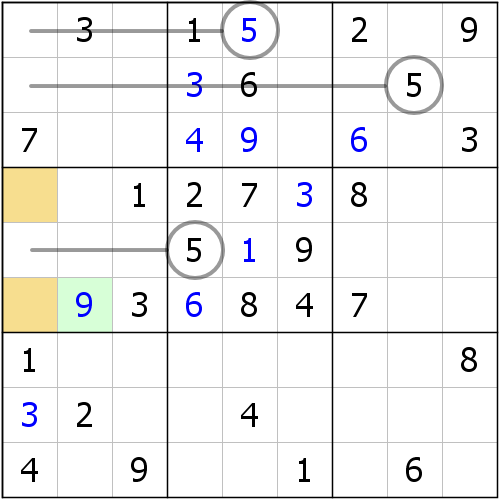

# 第 4 讲：区块

**区块**（**Locked Candidates**）也是我们常用的一种数独技巧。

## Part 1 宫区块（Pointing）

接下来为了表示清楚逻辑，我们使用两个典型的示例来介绍这个结构。

### 1-1 区块排除

如图所示，可以看到，数字3在b6里只有两处位置可填：r4c78。其它的情况都通过宫排除给排除掉了。现在我们虽然无法确定r4c78里到底是谁填3，但是我们可以发现，它们既同宫又同行。那么根据数独的规则，我们可以确定，r4上填入的3也只可能是在r4c78里，别无其它选择（否则r4里但凡出现不是在r4c78的数字3，都会同时使得r4c78都不能填入3，然后b6就没办法填3了，于是就违背了数独规则，形成矛盾）。这便使得r4c1不可填入3。

这一步的结论很重要。我们着重观察c1，并使用列排除。发现c1上能填入数字3的位置仅有r6c1，所以r6c1 = 3。

这个技巧就叫做区块。不过，区块这个词语也可以指代一种结构。我们可以把结构里用到的r4c78\(3\)叫做一个区块。由于这个结构产生于宫之中，所以称为**宫区块**（**Pointing**）。

> 我们使用 `单元格坐标(数字)` 的格式来表示单元格里的指定数值，比如 `r4c78(3)` 就表示r4c78里的数字3。这种写法大多都用来表示区块结构。

既然这个区块技巧依赖于排除法，那么我们就可以直接叫它**区块排除**。那么有区块排除，就有**区块唯一余数**，下面我们来看第二则示例。

### 1-2 区块唯一余数

如图所示，我们可以通过宫排除可以直接得到r79c1形成关于2的宫区块结构。那么由于r79c1又是同列的结构，所以这就使得c1里填入2的位置也只能是r79c1里。那么，与之同列的r6c1就不能填2了。

既然有了结论，我们就可以再通过唯一余数来一个一个数数，最终确定r6c1只可以填入数字8，所以r6c1 = 8。

可以看到，宫区块只是把排除升了下级，那么行区块和列区块这种东西又应该是什么样子呢？

## Part 2 行列排除（Claiming）

所谓的行列区块，和行列排除完全一样，就是产生在行或者列的区块。

### 2-1 行区块（Locked Candidates in Row）

如图所示。观察r7，数字1的位置只有r7c46，于是r7c46\(1\)便形成了区块结构，恰好它们同宫的关系，使得r9c5 &lt;&gt; 1，所以，对c5使用列排除，发现r1c5是能填入数字1的唯一位置，故r1c5 = 1。

### 2-2 列区块（Locked Candidates in Column）

如图所示，我们通过细致的列排除后发现，r125c1都不能填入数字5。这样便使得c1填5的位置只有r46c1，于是r46c1形成了5的区块结构。

此时，区块产生于c1上，所以是列区块。然后利用唯一余数的方式，对r6c2数数，并发现r6c2只能填入9（本应含有5这种情况的，但它被r46c1\(5\)的区块排除掉了，因为r46c1除了同列以外，还同宫）。

那么这个技巧和之前的取名方式类似，既有区块也有唯一余数，所以它就叫区块唯一余数。

有没有发现它很难观察？行列区块和行列排除一样，都是很难观察的东西，那么，我们有一个专门用于观察的辅助技巧：**组合区块**（**Cascading Locked Candidates**）。

## Part 3 组合区块/级联区块（Cascading Locked Candidates）

如图所示，这是一个关于数字6的列区块，因为区块的逻辑我们已经完全讲解过了，所以逻辑就自行理解了，这里着重阐述新视角。

我们尝试着将区块的这一列转移到与之排除能排除到的两个宫b25，你就会发现，b25都恰好存在6的区块，且构成了矩形形状，如图所示。

从这个示例可以发现，b2里r3c56\(6\)是一个宫区块，而b5里r6c56\(6\)也是一个宫区块，且它们构成了矩形形状。

这有什么用途呢？宫区块的推导是对行和列作排除，而两个宫区块我们就可以这么想：r3c56和r6c56两处都存在区块，而构成了矩形，这使得这两个区块的最终填数必然是“错开”的。即r3c56里要是r3c5填6，那r6c56里的r6c6才能填6；反之亦然。这样一来我们就能发现到，c5和c6的其余单元格都不允许填入6了，因为c5里必然会有数字6出现在r36c5里；同理，c6里也必然有数字6出现在r36c6里。所以，我们聚焦于r8c6，它的填数可能只有3和6，而6显然已经不可能了，所以只能是3，故r8c6 = 3。

可以从实际上看出，它的推理逻辑显然跟区块已经没啥太大的关系了，毕竟跨了两个区域后，推理也发生了变化。不过，我之所以说它的诞生旨在解决行列区块和行列排除的观察，就是因为它利用了宫区块的观察角度来代替了行列区块（比如这里的列区块，我们使用了两个宫区块代替掉了）。可能你会问，既然两个宫区块，那显然个数已经比一个列区块要多了，这岂不是不划算？不，相反地，它其实很划算。因为这种区块结构的观察利用到了宫内的区块，而宫区块最终依赖于宫的排除，宫排除是容易聚焦的，所以宫内的结构，区块也好，排除也好，都比行列性的结构要好看很多，甚至有时候，观察到三四个宫排除或宫区块的时间也不一定能看到一个行列排除或行列区块。所以，你可以尝试使用它来代替。

至于为什么级联区块结构能够代替掉行列区块或行列排除，它的理论依据和证明将依赖于非常难的逻辑，按照难度顺序来的话，这里就暂时先不给出证明了。

> **组合区块**（**Cascading Locked Candidates**）以前也叫做**级联区块**，其中“级联”一词取自微软公司Access软件里的**级联更新**（**Cascading Update**）和UI设计里**级联样式表**（简称**CSS**，**Cascading Style Sheet**）的级联，表示“相关联”的意思。有时候这个词也被翻译为“层叠”。
>
> 单词cascading的原形是cascade。

## 技巧信息

* **宫区块**：难度1.7。
* **行区块**：难度1.9。
* **列区块**：难度1.9。
* **组合区块**：难度2.8。

## 名词解释

* **区块**（**Locked Candidates**）：在某个区域下，某个数字的所有填数位置仅处于若干单元格内的情况。
* **宫区块**（**Pointing**）：可以指代带有宫区块结构的技巧，也可以指代宫区块结构：即区块在宫内的结构。
* **区块排除**：依赖于排除出数的区块技巧。
* **区块唯一余数**：依赖于唯一余数出数的区块技巧。
* **行列排除**（**Claiming**）：可以指代带有行列区块结构的技巧，也可以指代行列区块结构：即区块位于行或者列的结构。
* **组合区块**/**级联区块**（**Cascading Locked Candidates**）：若干区块共同构成一个矩形结构，并催生出数结论的技巧。这种结构一般用于代替行列排除和行列区块技巧的观察。
* **级联更新**（**Cascading Update**）：在数据库之中，如果若干表格存在依赖关系，那么一个变，后面跟着变的行为叫做级联更新。
* **级联样式表**/**层叠样式表**（**Cascading Style Sheet**）：一种辅助和美化普通 HTML 网页的机制。它的保存文件形式为 `*.css` 格式，每一个文件里都包含所有 HTML 标签指定的渲染样式规则。

