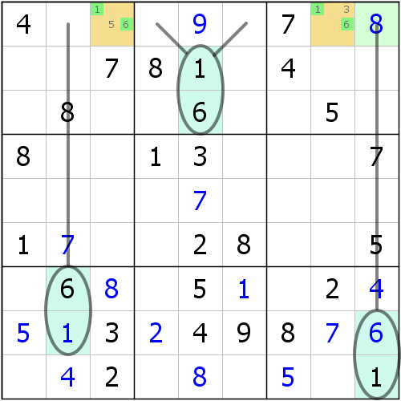
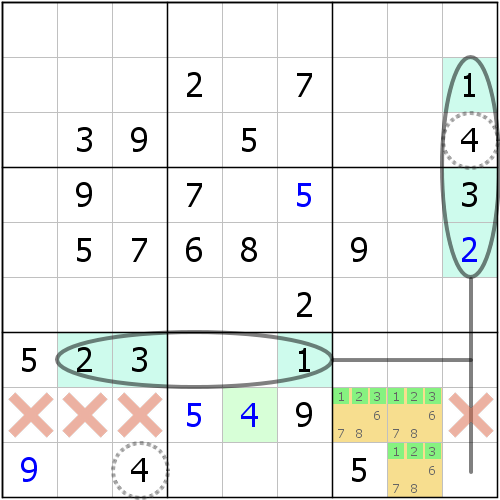
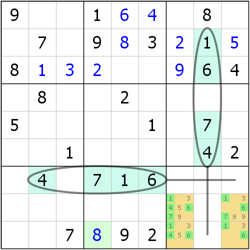

# 第 5 讲：隐性数组

现在我们来看一个新的数独技巧：**隐性数组**（**Hidden Subset**）。隐性数组是我们常用的第一种数组结构，不过它和区块不太一样的地方是，它有规格一说（有时候也叫做数组的**阶**，**Size**/**Order**）。所以我们这里得分成多个示例来讲解。

## Part 1 隐性数对（Hidden Pair）

如图所示，如果仔细观察r1c38两格，并观察r1里填入1和6的位置，你就能发现：通过外部1和6确定值的排除，我们可以快速发现，实际上r1里能放下1和6的地方，恰好都只剩下了橙色的r1c38两格。试想一下，假设我们在r1c3一格填入1，那么r1c8就必须填入6，不然r1里6的位置就没有地方放了；同理；如果r1c3填的是6，那r1c8就得是1才行，不然1就没办法放了。

这样便使得r1c38的填数必须得是一个1、一个6。自然而然就发现了，其它不是1和6的数字，比如数字8显然就不能填到r1c38里了。

接着我们重新对r1使用关于数字8的行排除，发现数字8最终只剩下了r1c9一格可以放，所以r1c9 = 8。

这个技巧的巧妙之处就是，利用了排除法确定了不止一个数字的最终填数位置，而是两个。这种结构从图上来看，把r1c38的数字全部标出来后也不能立马确定下格内1和6是确定了位置的，即必须通过排除。所以这种结构我们称为**隐性数对**（**Hidden Pair**），“隐性”体现在刚才说到的“必须通过排除才能看到，单元格内的填数情况标注出来无法立马确定”，而“数对”则是这个结构在涉及两格的时候，它的名字。

这个技巧称为**隐性数对排除**，因为用到了隐性数对和排除。

> 和区块的表示方式类似，我们可以把这个题目里的数对直接记作`r1c38(16)`，其中“16”表示1和6，而不是数字16，因为在数独里，我们只会用到1到9的数字，不会超过两位数，所以数字之间无需任何的分隔符号，这一点简写方式和c38的3和8类似。

## Part 2 隐性三数组（Hidden Triple）

那么我们现在来看看规格涉及三格的例子。

如图所示，仔细观察b9，你会发现数字1、2、3的位置只剩下{r8c78, r9c8}三格可填。

> 我们把多个单元格用大括号括起来，并把涉及的单元格写在里面。比如上面的写法就表示r8c7、r8c8和r9c8三个单元格。

要想在b9放下1、2、3三个数，而且还各一个，那只可能这样三个单元格里，一个1、一个2、一个3。其它的任意情况都会使得三个单元格的填数“不够平衡”，导致有一个数要么多出来一次，要么有的数字根本不会出现。比如这三个单元格里出现了一个7，那么必然就会使得1、2、3的其中有一个数字无法放到b9里，使得填法直接违背了“1到9每个数字都得各一个”的规则。所以，我们不能允许这样的事情发生，故只能是一个1、一个2、一个3。

这样便使得{r8c78, r9c8}三格只能填入1、2、3这三种数字。然后转去观察r8，可以发现，现在4只有一处可以放，即r8c5，其它的情况都被排除掉了。所以，r8c5 = 4。

> 当然，这个结构因为规格变为3的关系，我们称{r8c78, r9c8}\(123\)为**隐性三数组**（**Hidden Triple**），当规格超过两格的时候，我们直接称为“n数组”，其中n表示规格数。当然了，一般建议n写成数字的汉字写法，即一般不习惯写成“3数组”。
>
> 另外，`{r8c78, r9c8}(123)`表示这三个单元格里的1、2、3，这是一种“泛指”，并不是说里面有些格子没有1，或者没2，或者没3就不能写在一起。当你的表述逻辑可以用这个泛指来表达时，就可以这么写。

## Part 3 隐性四数组（Hidden Quadruple）

如图所示，和刚才的逻辑类似，我们可以通过排除法，发现b9里填入1、4、6、7的地方都只剩下了r89c79四个单元格。那么，为了保证b9里必须得出现1到9都各一个的话，四格必须是一个1、一个4、一个6和一个7。

> 这里啰嗦一点。你可能注意到了，它和之前的示例有所不同的地方是，r89c79四格并不是所有单元格都恰好包含全部的1、4、6、7的，比如r9c7只有1、4、6，没有7，这一点是否会影响我们继续往下推理的逻辑呢？不影响。因为它不重要。之所以说它不重要，是因为我们只需要确定下1、4、6、7在里面确实是各有一个就行了。在形成结构后，把这四格不是1、4、6、7的其余情况全都给它排除掉就可以了，而具体它的内部到底少了哪些数字，从刚才的推理里我们也应当看出，其实我们并不关心这一点；当然了，如果数字少到直接都可以使用排除和唯一余数技巧了的话，那就另说了。

接着观察r9，就可以发现数字8只剩下r9c4可以填了，所以r9c4 = 8。

这个例子用到了规格是四格的情况，所以称为**隐性四数组**（**Hidden Quadruple**）。

> 隐性四数组经常出现像示例里这样，结构里部分单元格缺少一部分数字的情况，但因为它不影响我们的推理，所以我们表述的时候依然可以使用`r89c79(1467)`的方式，即使这个表达看起来好像是必须r8c7、r8c9、r9c7、r9c9四格必须都得包含全部的1、4、6、7一样。

## Part 4 怎么观察？

在示例里，其实我们已经提到了它的观察，它的观察就是利用排除（行、列、宫排除）来寻找隐性数组结构。排除是相对于唯一余数看起来似乎简单一些的技巧，所以我们可以利用这一点来观察到更多的排除结论。

## 技巧信息

* **隐性数对**：难度系数：3.4。
* **隐性三数组**：难度系数：4.0。
* **隐性四数组**：难度系数：5.4。

> 你可能会问，为什么规格不一样，差别这么大。实际上是这样的：隐性四数组和隐性三数组出现频率都比较少，结构的规格使得这些技巧出现频率不高（隐性四数组甚至几万道题才能出一个出来，完全随机出题的情况下）。这个难度系数是综合观察难度、技巧理解难度和出现频率三个因素综合构成的，所以难度差异较大。说实在的，我确实能随便找到隐性数对，但是隐性三数组和隐性四数组真的很少看得到，题目能出现这种技巧的频率不高导致我基本用不上它，更别说隐性四数组了。

## 名词解释

* **数组**（**Subset**/**Locked Set**）：表示数组这种结构，也可以表示用到了数组结构的这个技巧。数组一共分两种：**显性数组**（**Naked Subset**）和隐性数组，这一部分主要讲的是隐性数组，显性数组在下一讲会提到。
* **显性数组**（**Naked Subset**）：下一讲会说的另外一种数组推理模型。
* **规格**、**阶**（**Size**/**Order**）：数组的规格。
* **隐性数对排除**：指代的是隐性数对结构使用后，可以利用排除得到**出数**（**Assignment**）结论的技巧名称。你可以理解为“隐性数对 + 排除”。
* **出数**（**Assignment**）：可以通过推理得到某一个单元格填入哪个数字的结论的过程。

