# 第 6 讲：显性数组

讲完了隐性数组后，可以发现隐性数组用了排除来作为辅助的操作，那么下面要讲的第二种数组结构——显性数组，可以猜得到，肯定用的是唯一余数了。

## Part 1 显性数对（Naked Pair）

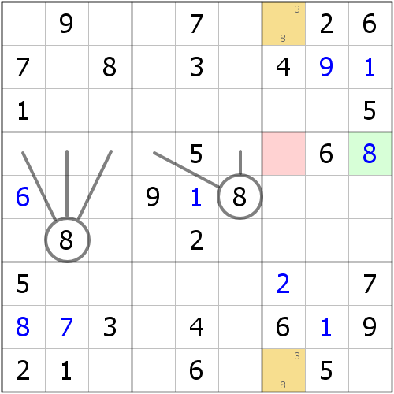

如图所示，仔细观察r19c7，对r19c7两格使用唯一余数的办法，可以发现，这两个最终都只能填入3或8。它们刚好同列，这就使得r1c7是3的话，r9c7就只能是8；反之亦然。

不论怎么填，这两个单元格显然是只可以填入3和8的，而且填的数字还不一样。这样一来，我们就能保证c7里数字3和8必须出现在r19c7里了，进而可以得到c7里的其余单元格都不能是3和8。

接着我们可以利用这一点，对r4作行排除，数字8此时只有r4c9可填，所以r4c9 = 8。

这个例子优秀的地方在于，r19c7不像刚才的隐性数组一般，它对区域其它单元格作出了填数情况的排除，并非自己涉及的单元格。之所以叫显性数组，就是因为它的结构里没有其它杂七杂八的数字，比如这个例子里，r19c7里只有3和8，很“干净”。这个例子涉及两格，所以叫做**显性数对**（**Naked Pair**）。

## Part 2 显性三数组（Naked Triple）

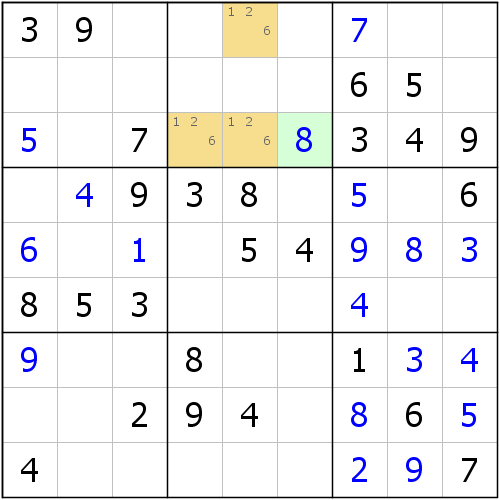

如图所示，仔细观察b2，通过唯一余数技巧数数你就会发现，{r1c5, r3c45}三格只能填入1、2、6。由于它们同处于一个宫，所以它们的填数一定互不相同；而且刚好三格，填入的数字就只可能是三个不同的数字1、2、6，也就是一个1、一个2、一个6。

我们此时转去观察r3c6，由于r3c6和{r1c5, r3c45}同处于一个宫，所以它的填数就不能是1、2、6了。那么，我们对r3c6再一次使用唯一余数，最终发现r3c6只能是8，所以r3c6 = 8。

这个结构和显性数对的思路是类似的，不过结构占了三格，所以我们称为**显性三数组**（**Naked Triple**）。

## Part 3 显性四数组（Naked Quadruple）

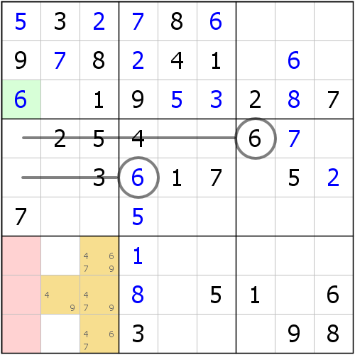

如图所示，这个例子有点难。着重观察b7里的{r8c2, r789c3}四格，这样四格恰都只包含4、6、7、9四种不同的数字，别无其它。由于它们同处于b7，这使得它们内部的填数是不可以一样的，又因为恰好四格的缘故，所以最终四格的填数只能是一个4、一个6、一个7和一个9。

由于r789c1和这四格同宫，所以r789c1显然是不能填入4、6、7、9的任意一个数的。此时我们观察c1，最终我们确定r3c1是填入6的唯一一处地方，所以r3c1 = 6。

这个例子就是**显性四数组**（**Naked Quadruple**）了。

## Part 4 那么问题来了，有五数组吗？

我们已经讲完了显性数组和隐性数组，不过你有没有发现，这些数组我们都没有讲到“五数组”甚至更高规格的数组结构，这未免会让我们引起怀疑。我可以先告诉你一个结论：**规格大于4的数组，不论是显性（Naked）的还是隐性（Hidden）的，理论上都不存在**。至于其原因，我们将在下一篇章的数组里进行详细讲解。

## Part 5 怎么观察？

我们讲完了显性数组，可以发现，显性数组的观察难度比隐性大太多了，首先是我们刚入门学习了唯一余数没多久，觉得唯一余数不如排除好观察；其次是这个技巧依赖于唯一余数的数数操作，所以这使得我们可能更加难以观察到它们。不过实际上，我们有一个稍显轻松的方法。

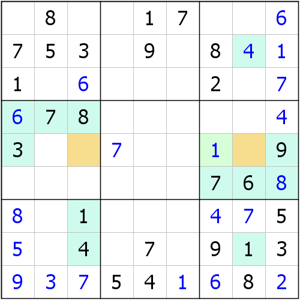

对于这个例子而言，橙色两格是一个显性数对，而我们可以从例子里发现，这两格的所属宫（一个b4，一个b6）的大部分确定值都是一样的，这使得我们引起警觉：由于大部分确定值都是一样的，那么某两格的候选数也就应当大概率出现一样的情况。此时我们就找到r5c3和r5c8两格，除了6、7、8相同以外，3和9的确定值也都恰好出现在r5上，这便使得r5c3和r5c8又有两个情况被同时排除掉，这样数下来，r5c38此时就只能是1、2、4、5了。

这个时候，我们又可以借助排除来获取信息：比如r5c3和r5c8的所在列都有1和4的确定值的提示信息，那么两格就只剩下2和5了。这便就形成了显性数对。

所以我们可以总结一下观察方式：**找出同一个区域的若干单元格，并大概扫描一下这若干单元格的所在宫（宫比较容易聚焦），来看它们的提示信息是否是真正的大部分都一样（不一定确定值都是完全一样的，只需要大部分相同就好）；如果有这种情况出现，我们就去看每一个单元格各自的所在行列看看是否真正有额外的影响，并最终来确定这若干个单元格究竟是不是显性数组。如果是，那么恭喜你，看看结论到底在哪里；如果不是，也不要灰心，我们依然可以利用这个规则来看看其它地方**。

## Part 6 隐藏在显性数组内部的区块

前面我们学了数组，也学了区块，那么数组能不能和区块一起用呢？我们来看看这个例子。

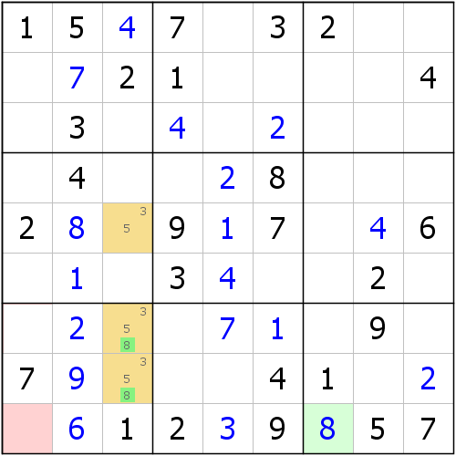

如图所示，我们可以看到这个示例里，r578c3\(358\)是一个显性三数组（前面说明了形成数组的原因，这里希望你自己思考）。不过其中我们发现，数字8只能出现在r78c3里，而r78c3又恰好同一个宫，于是b7其余单元格也就不允许填入8了，看起来这个r578c3除了三数组的结论，还带了一个推理很像区块的结论。得到这个结论后，我们就可以利用r9的行排除得到最终的r9c7 = 8了。

这里我们看到，这种数组里还外带了一个区块结论。目前，这种数组尚未拥有新的结构名，我们一般把这种区块称为**数组内区块**，即嵌入数组的区块结构，而整体的技巧则称为**区块数组**（**Naked Subset With Locked Candidates**，或简称**Naked Subset+**）。

## Part 7 死锁数组和割补数组（Locked Subset）

当然，有一种数组结构非常特殊，这种数组还有一种专门的观察方式和角度。

### 7-1 基本用法

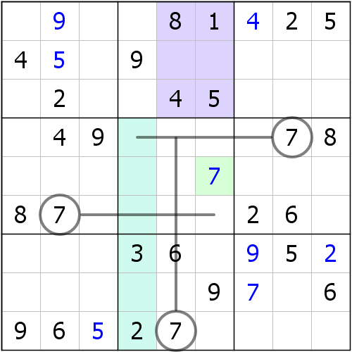

如图所示，不妨我们观察b2和c4。首先b2要填入1到9各一个，而c4也是。它们除了共用r123c4三格以外，其它的单元格都不同。但是，既然它们都要填1到9，而且r123c4又是共用的，那这不就说明了，r123c56和r456789c4的填数必须得是一一对应的。也就是说，r123c56里填的是哪6个数，r456789c4就得是哪6个数。

这一点很重要。我们再次观察r456789c4，发现里面只有两个提示数2和3，它们恰好在r123c56里都没有出现。r123c56里还剩两个空，这不就明示这俩空格必须一个2一个3了吗？换句话说，r456789c4里的空格就必须得填1、4、5、8了。

此时，我们对b5作排除，就可以确定7的位置了。

可以看到，这个例子里，7的位置的确定除了依赖于排除，还依赖于刚才区域填数相同的结论。实际上，利用区域填数一致的逻辑在一些其它变体类型的数独题里称为**Law of Leftover**（简称**LoL**），中文如果直译则直译成**剩余数法则**，而我比较喜欢叫它**割补**，因为它的逻辑是割了一个区域补到另一个区域的方式。而实际上，这个例子里产生了两个数对，一个是列上的四数组，一个是宫内的数对。但是……实际上这个所谓的**割补数组**指的并不是这两个数组，而是下图给的这个6、7数对。

下面我们还是用这个示例，看另外一种视角。

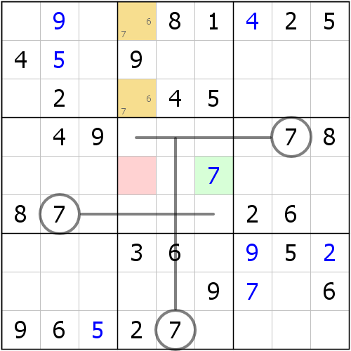

这个r13c4\(67\)的显性数对使用另外一种视角则是这样的：形成数对后，使得r5c3不能填入6或7，然后通过b5的宫排除，就可以确定7的位置了。

> 在技巧资料和一般的文章里，这种数组结构有一个专门的名称，叫做**死锁数组**（**Locked Subset**）。而割补法并非标准数独的技巧，而是一种叫做**锯齿数独**（**Jigsaw Sudoku**）的变体类型数独里的一种特殊技巧。

可以从例子里发现，这种数组最大的规格只能是三格，因为它无法跨出区域形成数组结构，否则就无法产生割补的效果了。那么我们不妨再来看一则示例，这个示例就是规格为3的情况。

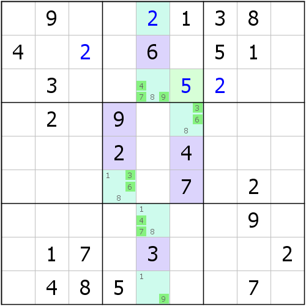

这个例子就自己推理了，思路和刚才的逻辑完全一样。

### 7-2 高级用法

既然我们说到，死锁数组利用的是割补法的思维，那么下面来看一下，我们如何把割补法用得更加高级一些。

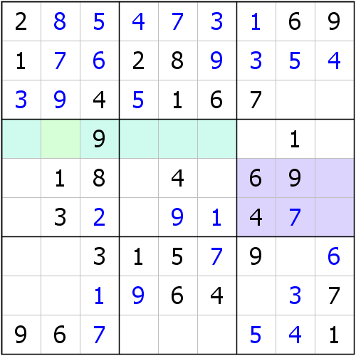

如图所示，我们可以利用r4和b6的割补法来得到结论，如果你能找到结论出现在r4c2上，那么恭喜你，你完全可以灵活使用这个技巧了；如果不能的话，也不要灰心。我们来看看，这个结构到底如何使用。

首先，我们通过最初的割补法，可以立马得到r56c789里的填数一定和r4c123456的填数是一样的。那么，我们发现，r56c789里有4、6、7，在r4c123456里都是没有出现的，所以我们就来看下，它们的填数情况。

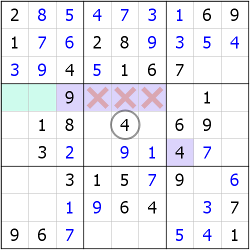

那么，我们先着重观察数字4的填法。4在r4c123456里只能放在r4c12上，因为r4c456都被b5这个宫内的r5c5的提示数4排除掉了，所以我们只能把4放在r4c12上。

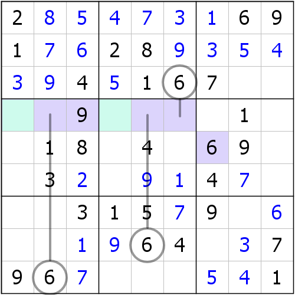

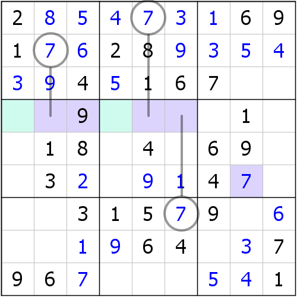

另外两则情况则完全同理。6和7的填数位置都仅能放在r4c14上。

所以，实际上4、6、7只能放在r4c124上，这是满足隐性三数组的数组定义的，所以它们构成了隐性三数组的结构，于是我们就可以通过唯一余数，得到最终的填数结论在r4c2了。

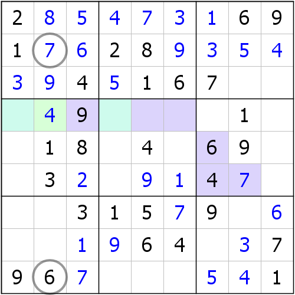

由于构成了隐性三数组，所以r4c124里只能放入4、6、7，而r4c2只能放入4，所以r4c2 = 4，便是这个技巧的结论了。

> 当然，你也可以发现，6、7在刚才的推导过程里，已经构成了隐性数对，那么就不用这么麻烦地推导到这里，再通过唯一余数得到结论了。这只是其中的一个参考思路。

## 技巧信息

* **显性数对**：难度3.0。
* **显性三数组**：难度3.6。
* **显性四数组**：难度5.0。
* **死锁数对**：难度2.0。
* **死锁三数组**：难度2.5。
* **区块三数组**：难度3.7。
* **区块四数组**：难度5.1。

> 割补数组只是死锁数组的另外一种观察视角，所以难度不作分析。另外，死锁数组没有四数组，区块数组没有数对。你可以思考一下，为什么这两种情况都不存在。

## 名词解释

* **显性**（**Naked**）：结构通过唯一余数的数数操作进行数字的枚举，最终这样看出来的结构就叫做显性的结构。有时候因为它是用的唯一余数技巧，所以也称**唯余的结构**。比如显性数对又可以叫做**数对唯余**。但请你把这种叫法和“数对 + 唯余”的推理模式分开，它们不是一个东西，只是恰好名字一样罢了。
* **隐性**（**Hidden**）：结构通过排除的操作对位置进行枚举，最终这样看出来的结构就叫做隐性的结构。有时候因为它用的是排除技巧，所以也称**排除的结构**，或者**占位的结构**。比如隐性数对又可以叫做**数对占位**或者**排除数对**。但请你把这种叫法和“数对 + 排除”的推理模式分开，它们不是一个东西，只是恰好名字一样罢了。
* **数组内区块**（**Locked Candidates in Naked Subsets**）：通过一个显性数组推理后，结构内会产生一个区块。这个区块结构就叫做数组内区块。
* **区块数组**（**Naked Subset+**）：带有数组内区块的数组类型。
* **剩余数法则**、**割补**（**Law of Leftover**，简称**LoL**）：一种变种数独类型的技巧。
* **割补数组**：死锁数组结构的另外一种视角，即借用割补来推理，产生的数组形式。
* **死锁数组**（**Locked Subset**）：一种特殊的显性数组，这种数组里的所有数字都可以是数组内区块。
* **锯齿数独**（**Jigsaw Sudoku**）：一种变种数独类型题目。

