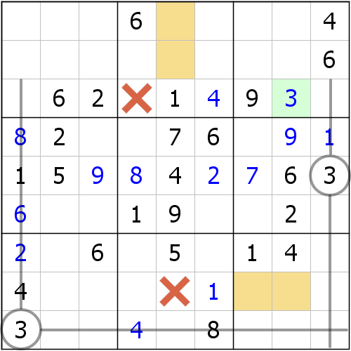
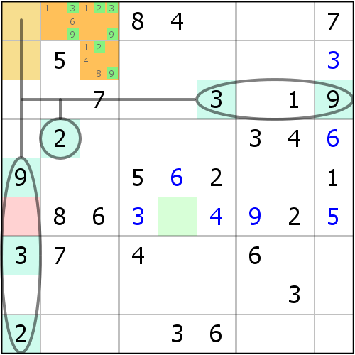
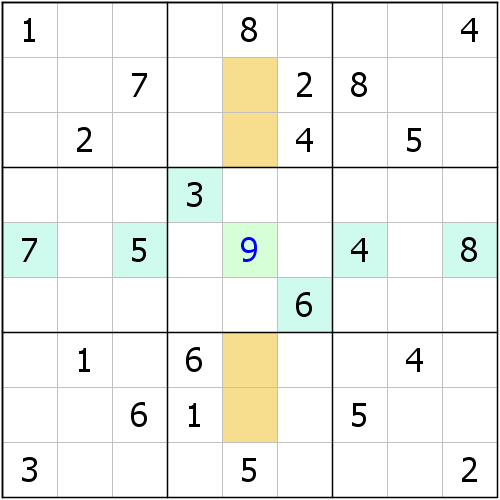
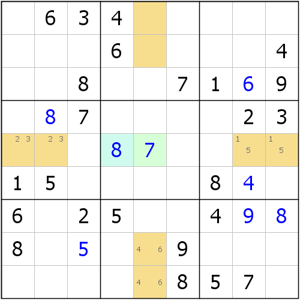

# 第 7 讲：复合结构技巧

前面已经讲到了一些复合结构，例如一个排除需要同时动用多个区块、多个数组或者区块数组混合使用的，那么这种东西被我们称为**复合结构**（**Complex Pattern**）。显然，复合的方式千变万化，也就应该拥有千变万化的组合，形成千变万化的变体。那么现在我们就找出一些非常常见的复合方式，或者是比赛的例题来作讲解。

> 注意，本文（包括后面和前面的讲解用到的题目）里用到的大型比赛的题目是不能随意使用的，这里的题目都经过了授权（当然不需要授权的题目就不管它们，需要授权的则必须经过同意和协定来合理合法使用）。
>
> 为什么才说这个呢？因为这一节用到的比其他的多一些。

## Part 1 递进关系

### 1-1 示例 1：宫区块 + 行列区块 + 排除

有一些时候，区块之间是可以套用，或者说有递推关系的。比如下面这个例子。

如图所示，我们先可以观察到b9里存在一个3的宫区块，于是通过排除，我们可以得到r8c5 &lt;&gt; 3。

接着，我们继续观察c5，发现c5此时只能把3放在r12c5里，所以此时它们形成列区块结构，而因为它们同宫，所以b2里其余单元格都不能放下3。所以此时r3c4 &lt;&gt; 3。

最后，正是因为这一点，我们观察r3，并最终确定了3的真正填数位置。通过排除，我们最终确定r3c9是唯一的能放3的单元格，所以r3c9 = 3。

这个例子巧妙的地方在于，它连着使用了两个区块，一个是宫区块，而另外一个则是行列区块。

### 1-2 示例 2：数组 + 区块 + 排除

如图所示，这个例子是一个典型的数组+区块+排除的特别厉害的示例。首先，我们可以通过2、3、9对b1的排除，得到{r1c23, r2c3}\(239\)形成隐性三数组结构。

在得到数组结论后，r1c23和r2c3就不允许填入不是2、3、9的其它数字了。接着我们就可以在b1里发现数字1的区块结构，位于r12c1（r3c1不能填1，因为r3c8是1）。

那么，得到区块后，我们再对r6使用排除法，确定了1的填数位置最终只能是r6c5，所以r6c5 = 1。

这个例子先使用了数组，然后得到了区块结构；然后区块后又得到了行排除才出现了结论。

## Part 2 同步关系

### 2-1 示例 3：区块 + 唯一余数

现在我们来看一道题目。为了讲解这个技巧，我专门出了此题。

我们针对r5c5作唯一余数的数数操作。其中数字1和2没有确定值，而3到9在r5c5的相关格里都有对应的确定值，所以r5c5只能是1、2、9的其一。

然后，我们在b2里可以发现，1的填数位置只能是r23c5，所以r23c5\(1\)形成区块，致使r5c5 &lt;&gt; 1；而对应的对称的b8，也有一个2的区块。所以最终1和2都不能填入到r5c5，所以r5c5 = 9。

> 这个题巧妙的地方在于，第一步就必须使用这个技巧，否则要想绕过这个技巧，必须使用死锁数组或三数组结构。所以这一点来说，我还是很自豪的。

### 2-2 示例 4：数组 + 区块 + 唯一余数

我们再来看一个比赛的题目。

这个题目在出了一部分数字后，依然无法继续往下填数。此时得需要一个唯一余数技巧来瓦解题目。

正如图上标注的一样，r12c5是一个9区块，r5c12\(23\)是一个隐性数对，r5c89\(15\)是一个隐性数对，r89c5\(46\)是一个隐性数对，再配合r5c4的确定值8，我们最终确定了r5c5 = 7。

至此，直观类技巧我们就讲完了。直观的部分，剩下的就得靠你自己了。

## 技巧信息

* **复合结构技巧**：不好说。难度随着使用的技巧和组合方式不同而变化。暂时没有一个通用的数学公式来计算得到。

## 名词解释

* **复合结构**（**Complex Pattern**）：以多种不同的结构呈同步使用关系或递进使用关系的，叫做复合结构。

