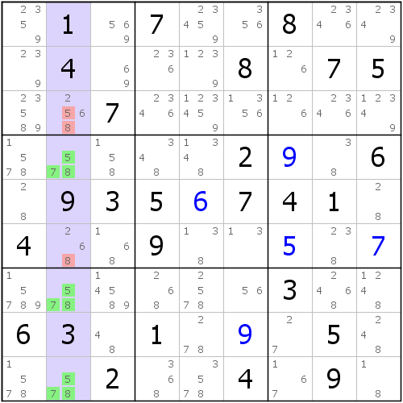

# 第 8 讲：候选数初步

从这个篇章开始，我们将为大家介绍到的是候选数技巧。所谓的**候选数**（**Candidate**），就是我们之前提到的，单元格里的填数情况。

这个板块给出的技巧，都是超过一般比赛难度的技巧，它们也是完成难题的基础。

> 上一个篇章是从第1讲到第7讲。

## Part 1 候选数初步

为了叙述方便，我们先把后面要说到的内容全部大体的框架说一下。

### 1-1 做题模式

首先，题目大致分为如下三种做题模式：

* **直观**（**Direct**）；
* **局部标记**（**局标**，**Partial Marked**）；
* **全部标记**（**全标**，**Full Marked**）。

这三种做题模式都有自己的策略。直观是直接通过空白的盘面上手就开始做题的手段；而局部标记就是之前数对里使用的方式，在一部分单元格里标注出候选数来达到辅助做题的目的；而全标就是全盘的所有空格的所有候选数都标注出来。而我们后续的讲解，都是采用全标的形式来解释和描述的。因为后面的技巧一般都较难，所以标注出它们是非常有效的（直观层面一般都做不了）。

### 1-2 出数和删数

接下来说一下，什么是**出数**（**Assignment**），什么是**删数**（**Elimination**）。出数指的是能够得出填数结论的行为，比如之前的技巧，利用区块和数组来达到排除和唯一余数的结论，这种就叫出数结论；而删数，则是针对于候选数而言。得到的推理结论仅仅是排除一个候选数情况的行为（我们称为删除或删减情况，所以叫做删数，而不是“排数”）。

介绍了这么多后，我们开始正式进入候选数技巧的学习。不过为了我们能够更好过渡到候选数层面（全标层面），我们依然先得介绍区块和数组结构。

> 不过，区块和数组的逻辑已经讲得比较清楚了，这里的全标示例仅给出图片和一些简单的逻辑解析。

## Part 2 区块（Locked Candidates）

### 2-1 宫区块（Pointing）


第一则示例是宫区块，因为转变了视角，所以结论就不再是出数的了，而是删数：

```text
宫区块：r5c78(9) => r5c12 <> 9
```

我们使用推出符号“=&gt;”表示前者可以推出后面的结论，所有后面的结论使用到了这个符号都算作是推出符号。

### 2-2 行列区块（Claiming）


如图所示，描述如下：

```text
行区块：r8c13(7) => r7c1, r9c13 <> 7
```

结论里（推出符号后的部分）即使出现多个单元格，也不需要使用大括号括起来，例如结论里r7c1和r9c13指的是同时都可以删除7，而并不是强调这些单元格的候选数7，所以此时的大括号是可以省略的（当然也可以写上去）。

## Part 3 数组（Subset）

接下来我们来快速浏览几则数组示例，然后提一些在前面数组没有说到的东西。

> 不过，因为改变为全标视角后，唯一余数就显得观察起来相当简单，所以与之有所关联的显性数组此时被我调整在了隐性数组之前，先给出例子。

### 3-1 显性数组（Naked Subset）

#### 3-1-1 显性数对（Naked Pair）


```text
显性数对：{r7c9, r9c7}(23) => r89c9 <> 2, r9c89 <> 3
```

#### 3-1-2 显性三数组（Naked Triple）



```text
显性三数组：r479c2(578) => r3c2 <> 58, r6c2 <> 8
```

#### 3-1-3 显性四数组（Naked Quadruple）


```text
显性四数组：r2c4789(2489) => r2c12 <> 2, r2c25 <> 4, r2c135 <> 8
```

### 3-2 隐性数组（Hidden Subset）

#### 3-2-1 隐性数对（Hidden Pair）


```text
隐性数对：r46c3(79) => r4c3 <> 456, r6c3 <> 346
```

隐性数组的候选数视角有一点不好入门。这里简单说一下。

从候选数角度来看，可以发现b4里，能放7和9的位置只有r46c3，由于同一区域的关系，于是它们就形成了隐性数对了。

#### 3-2-2 隐性三数组（Hidden Triple）


```text
隐性三数组：r568c2(378) => r5c2 <> 69, r6c2 <> 59, r8c2 <> 69
```

#### 3-2-3 隐性四数组（Hidden Quadruple）


```text
隐性四数组：r7c2378(1567) => r7c2 <> 248, r7c3 <> 8, r7c7 <> 9, r7c8 <> 2
```

### 3-3 区块数组（Naked Subset+）

#### 3-3-1 区块三数组（Naked Triple+）


```text
区块三数组：r278c5(49), r78c5(6) => r3c5 <> 4, r13c5, r8c6 <> 6, r19c5 <> 9
```

#### 3-3-2 区块四数组（Naked Quadruple+）


```text
区块四数组：r4c789(14), {r4c789, r5c7}(39) => r4c1 <> 14, r5c8 <> 3, r5c9 <> 39, r6c8 <> 4, r6c9 <> 14
```

### 3-4 真·为什么没有五数组？

那么，回到直观类技巧里遗留的问题：为什么我们不具有五数组，或者更大规格的数组呢？这里我们将为大家解释这一点。

#### 3-4-1 显隐性互补

有没有想过一种证明思路，就是通过显性和隐性的某种特性，使得一旦有显性的时候，隐性就一定不能出现超过规格为4的情况呢？


我们找出了一个稍微极端的例子。例如左图，我们可以发现它实际上是一个显性数对结构。不过我们拿出同样的例子，只是切换技巧，可以变成右图这样，图中的例子立马变为了一个隐性数组。

细数右图的隐性数组，可以发现它的规格是5，即一个五数组，而我们仅仅是把删数不动，把原来涂了色的数字变为不涂色，而不涂色的候选数变为涂了色。那么形成这样的原因是为什么呢？

一列一共是9格，除去两格已经有确定值的关系，所以只剩下7个空格。一旦这7个格子里有一个显性数组结构，那么必然会存在一个隐性数组，规格呢？规格就是抛开这个显性数组结构涉及的格子之外，剩下的单元格全部构成一个隐性数组，这么大的规格。

你可能会问：这样真的什么时候都可行吗？答案是显然的。我们从另外一个维度来看一则极端的例子。


我们来看这一则示例，首先从左图可以看到它是一个隐性数对；而我们对照右图可以发现，剩余四格构成了显性四数组。别急，你是不是看到，四数组里除了r8c7有一个4以外，其它格子都没有4啊？对，这就是这个示例要告诉大家的东西。

它实际上也属于数组，而且是一个合格的显性四数组结构，不过由于受到其它4的确定值的影响，4最终在结构里只有一处可填。这本身没有问题。不过，因为它依然满足四个单元格里只有四种不相同的数字，所以它从这个层面来说，确实是四数组。只是，这里最终我们能确定一点，这一行其余位置的候选数4都删除掉后，4就真的只有r8c7一处可以填了！所以除了刚才删数结论外，这种数组还有一个出数结果：r8c7 = 4，于是，四数组降阶为了三数组。

虽说降阶，但是实际上还是合适的。如果我们此时不再把这个四数组看作真正的四数组，而是只看r8c236三格，就会发现它实际上就是一个显性三数组，所以此时得到的删数是r8c7\(78\)，此时直接利用唯一余数就能够出数了。

所以，总的来说，**只要有显性数组，就必然在这个区域里存在与之互补的隐性数组；反之亦然**。那么，我们来简单计算一下，为什么没有五数组，或更高规格的数组。

显然，五数组的存在就必然存在与之对应互补的另外一个数组，这个数组的规格必然小于或等于4。所以，即使我们能够发现这样的数组，结构也存在与之互补的另外一个规格小于5的数组，所以，理论上是不存在五数组或更高规格的数组的。

#### 3-4-2 为什么要提显隐性互补？

那么，为什么要提起显隐性互补呢？提起它的原因很简单：为了解决看不到某种数组的关系。因为显隐性互补的存在，我们在观察显性数组的时候，就可以使用隐性数组的互补视角来进行代换。隐性数组仅通过排除可以得到，所以我们更容易发现它；既然发现了隐性数组，也就间接地相当于发现了显性数组。所以，如果你对显性数组不熟悉，可以使用隐性数组来进行代换。这就是互补存在的意义。

## 3-5 提一下命名

最后说一下数组的命名格式和规范。最开始，数组被称为**链数**，比如三数组最开始被称为**三链数**。不过链数一词来源于中国台湾的谢道台老师，后面中国大陆也在推广数独，并使用适合大陆习惯的称呼数组一词。所以链数也就变为数组了，实际上它们是一个东西。而在英语里，数组一词有多个翻译：subset（子集）、tuple（元组）等。subset来自于数学术语set（集合），而tuple来自于计算机编程的数据结构元组：

```text
(string name, int age, bool isGirl) = ("Sunnie", 24, false);
```

即使我们知道，数组在五阶及其以上的时候并不存在，但在数独里，它们依然是被命了名的：

* 数对：pair；
* 三数组：triple；
* 四数组：quadruple；
* 五数组：quintuple；
* 六数组：sextuple；
* 七数组：septuple。

数组里没有八数组和九数组，因为互补的最大规格才等于1或0，这在数组里显然是不可能也没必要出现的。

好了，具体内容就说到这里。数组我们就说完了。

## 技巧信息

本文尚未包含新的技巧。

## 名词解释

* **候选数**（**Candidate**）：表示某个单元格的可能填入的情况。一个可能情况就是一个候选数。
* **直观**（**Direct**）：表示不需要标记任何候选数就可以完成的做题模式。
* **局部标记**（**Partial Marked**）：标记其中某一个或某一些单元格的候选数，用于辅助推理的做题模式。
* **全部标记**（**Full Marked**）：将盘面的所有单元格的所有可能填数情况都标记出来的做题模式。
* **出数**（**Assignment**）：通过技巧得到某处填入某个数的结论的行为。
* **删数**（**Elimination**）：通过技巧得到某处的某个数（或某些数字）肯定可以去除掉的行为。
* **链数**（**Subset**）：谢老师（谢道台）对数组技巧早期的称呼。谢老师是原台湾数独协会（TSA）的会长，每日发布五道数独题目。
* **三链数**（**Triple**）：三数组的另称。
* **子集**（**Subset**）：数学用语，表示集合的其中某个部分。空集是任何集合的子集。
* **元组**（**Tuple**）：Python 和 C\# 等编程语言里表示一组数据的术语词。
* **集合**（**Set**）：数学和编程用语，表示一系列数据的统称。

