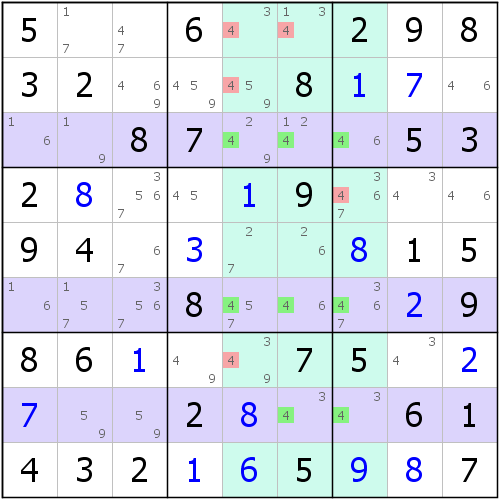

# 第 9 讲：鱼不止可以吃，也可以当技巧用

我们进入一个新的技巧。这个技巧有一个比较好吃的名字：**鱼**（**Fish**）。

> 有些地方鱼也可以叫**链列**。不过这个词语已经弃用，因为“过时”了。

## Part 1 X-Wing

如图所示，可以观察到，r18两行里，能放下6的地方现在仅剩4个单元格，而且这4个单元格又恰好构成矩形的形状。那么不论如何，6的摆放位置只可以是对角两格的填数情况是一样的。换句话说，要么左上角r1c2和右下角r8c6同时填6，要么右上角r1c6和左下角r8c2同时填6，没有其它情况。

注意，马上要得到的这一点很重要！虽说我们无法确定6的确切位置，但我们可以发现，6在c26里的填数也必须只能在r18c26四个单元格里。因为刚才的说明已经得到了，两种情况里必须得有一个情况是对的，我们此时假设我们聚焦于c2来看，第一种情况下，c2里会填入一个6在r1c2上；而第二种情况下c2里会填入一个6在r8c2上。这使得两种情况里，都会出现一个6在r18c2里；同理，聚焦于c6也是如此：第一种情况下填入到的地方是r8c6；而第二种情况则填入到r1c6。

虽说文字有些绕，我觉得你应该能明白我想表达的意思。那么既然这样的结构除了在r18里保证出现6，还能保证c26里也各有一个6在这四个单元格里，那么很显然，c26的其余位置都不能再填入6了，毕竟这两列的6已经只能放在r18c26里了。所以其余位置的6都可以被删除，于是有r9c2, r379c6 &lt;&gt; 6。

这个技巧的巧妙之处在于，它的推理逻辑和之前我们说到过的一个技巧：组合区块很类似。在组合区块里，我们也是把区块当成了这样的形式，然后发现只能处于结构对角线的两格的填数情况才是一样的。这种结构实际上被称之为鱼或链列，而鱼和数组一样，也是有规格（阶）一说的，所以这个鱼的规格是涉及两行两列，因此被称为二阶，一般我们称这种结构叫做**二阶鱼**（不过这个技巧一般用的是英文名**X-Wing**）。这个鱼的**阶**（**Order**/**Size**）跟数组的阶差不多，鱼的阶指的是涉及的定义域区域总数。比如这里涉及的定义域区域是两个：r1和r8，所以是2阶的。

> 二阶鱼（X-Wing）有时候也被叫做**二链列**。

## Part 2 一些术语

在鱼的体系里，充满着各种诡异可怕的术语，但不要怕，我们这里提到一部分我们常用的，而复杂和难懂的术语，当后面用到的时候，我们才会提及。

* **定义域**（**Defining Set**/**Base Set**）：结构被定义下来的位置，比如这个例子里，定义域为r18（因为我们发现r18里填入6的位置只有四格，所以称这种东西叫做定义域）。
* **删除域**（或者叫**删数域**，**Secondary Set**/**Cover Set**）：能删除候选数情况的区域，比如这里的c26就是这个鱼的删除域。
* **鱼身**（**Body**）：结构涉及的所有单元格，比如前面这个示例下的r18c26就是鱼身。

目前就只需要提及这样几个简单的术语。

## Part 3 三链列/剑鱼（Swordfish）

那么既然鱼也有规格，那么何不把它扩展到三阶的情况呢？我们来看看三阶的情况。

### 3-1 一个奇怪的例子

如图所示，变成三阶后，这个例子实际上就比以前的结构看起来要复杂太多了：单元格涉及的数量就从4飞升到了9，涨了一倍还多。没关系，别怕。

由于这个结构涉及恰好3  _3 = 9个单元格（乘号用“_”代替，除号用“/”代替，方便打字，后同），即三行三列，显然这说明了在鱼身里必须填入刚好3个4，而且还不能违背数独规则（即同一个区域里有相同的数字）。那么，你随便放置这些4，你都会发现，因为是三行三列的结构，所以为了保证行列宫之间不出现重复的冲突，数字只能错开分布，而且4的位置也必须得在c567的每一列里都恰好要出现一个4才行。这是显然的，因为只有三行的关系，每一行放一个4还不重复的话，对于列的角度而言，由于列也恰好是三个，所以必须是每一列都有一个4。这便使得c567之中各有一个4出现在鱼身里。于是，删除域便形成了：c567，所以c567的其余单元格的候选数4都将被删除。

这个结构由于是三阶的，所以称为**三阶鱼**，而由于它的技巧英文名叫做**Swordfish**，所以这个结构也总被称为**剑鱼**。不过。看起来似乎二链列的逻辑和三链列差别有点大，不过……你可以试试看，用现在这里的三链列的思维套用到二链列上，你就会发现，二链列实际上也可以用这个逻辑来理解，之前只是为了方便理解，直接写上了二链列它自己单独的视角罢了（其实这两种说法是等价的）。

> 同理，三阶鱼有时候也被叫做**三链列**。

### 3-2 奇怪的事情发生了

慢着，你是不是没有看到r9c7啊，这不是唯一余数吗（一个单元格就只有一个候选数的时候，就可以称这个单元格是唯一余数了，这和我们之前学到的唯一余数的逻辑是一样的）。很明显，出了这些数字后，岂不是4就显然不能这么放了，而是这样：

是的。但我想告诉你，这不影响我们使用鱼技巧。换言之，这种**残缺**（**Incomplete**）的结构依然是可以使用鱼技巧的。这是为什么呢？这是因为我们在刚才三链列的逻辑的时候，并不关心内部是否有残缺，而仅仅是看到结构涉及三行三列后，为了保证每一行列都要出现一个数字4，那么必然要让4放置在行列互不冲突的三个单元格上，而结构是否残缺并不会影响最终4要每一列都有一个的要求。所以，这种鱼依然是可行的，并且删除域、定义域依然不会发生变化，只是鱼身少了一格r8c5。

那么，我们再来看两则示例（左图和右图），来好好体会和理解刚才我们说到的残缺。

## Part 4 四阶鱼（Jellyfish）

三阶的结构大体的逻辑就可以理解成“三行的结构只出现在不同的三列里”，那么四阶就依葫芦画瓢：“四行的结构只出现在不同的四列里”。不过……这个例子是反过来了。

如图所示。这一次我们把c2378当成定义域。

发现，c2378里能放置9的位置只出现在r1247这样不同的四行上。为了我们要在这个c2378里每一列都放上一个9，还得不同行列（不产生冲突），我们发现，唯有把9放置在r1247，每一列都有一个9的时候，才不会冲突。所以，r1247就是这个结构的删除域了。不过这个例子厉害的地方在于，所有红色的数字都可以删除掉，而且除了r2c5有一个1外，它的删数基本上占满了整行，足足19个删数。

这个例子的规格是4，所以叫**四阶鱼**或**四链列**（**Jellyfish**）。

## Part 5 鱼的互补

在鱼里，好像我们也没有说到五阶甚至更高规格的鱼，这一点是为什么呢？难道它和数组一样？是的。鱼也有互补，而正是因为它有互补，所以才不存在五阶甚至更高规格的鱼。如图所示，这是两个鱼的互补情况。

如图所示，这是两个互补的鱼结构，随便先看哪个例子都行。

比如左图，我们作为“基准”示例来看，它实际上是一个有残缺的三阶鱼结构，而删数也都是成立的（这一点我这里就不再说明了，因为这个例子在之前是有出现的，所以就请你自行推理了）。

不过，我们把剩下没有被涂色的单元格里（白色）的所有5都找到，然后按照**正交**（**Orthogonal**）的形式画出定义域。所谓的正交，就是说，如果原来是行，那与之正交的就是列；如果是列，与之正交的就是行。那么因为“基准”示例的定义域是行，所以我们正交的例子的定义域就必须是若干个列。

此时，我们又得到了右图的这个鱼，虽然它也是残缺的，但是我们只转变了定义域和删除域的情况，但发现，其实删数却没有丝毫变化，这一点和我们之前数组的显隐性互补很类似，删数是一样的，所以我们才称这两个鱼互补。

正是因为这种形式的出现，所以我们才不可能拥有超过4阶的鱼结构：**盘面整体是9阶的，如果某个数字在n个正交的行列里都没有出现，则说明这个数字一旦形成鱼结构，那么它的最高规格就不能超过9 - n。而如果在这个数里能找到一个m阶的鱼，那与之互补的鱼的阶数必然是9 - n - m，但因为n不能超过4，所以9 - n - m这个数是永远都不可以超过4的**。说起来很学术，实际上对照图上说就很清晰：如果把所有5都画出来，然后行列都标出来就会发现，它实际上只占据六行六列。既然鱼存在互补，那么两个鱼的规格之和就必须是6，你不能因为互补，规格之和都超过6了，这显然不可能（毕竟6行6列只能最多填入6个这个数进去，规格之和超过6就意味着两种鱼内，填这个数的总量已经超过6个了，我们只能填6了，所以这就矛盾了）。

所以，**鱼的规格也不可能超过4**。

## Part 6 说一下命名

还是老规矩，和数组一样，说一下普通鱼的名称。

因为普通鱼都有自己的名词，是用鱼来表示的，所以每一个阶的鱼都有自己的名字，如下：

* **二阶鱼**：**X-Wing**；
* **三阶鱼**：**Swordfish**（**剑鱼**）；
* **四阶鱼**：**Jellyfish**（**水母**）；
* **五阶鱼**：**Squirmbag**/**Starfish**（**海星**）；
* **六阶鱼**：**Whale**（**鲸鱼**）；
* **七阶鱼**：**Leviathan**（**海怪**，传说里的海中之妖怪）。

> 其中五链列的Squirmbag和Starfish是等价的两个说法，意思是一样的，都指的是五链列，用法没有丝毫区别。但是Squirmbag这个词语没有中文释义，甚至连直译都没有，不过这个词语是Squirm（蠕动）和bag（包）的自然拼接词，至于为什么，我稍后会作出说明。

和数组一样，它没有八链列和九链列，因为刚才的公式告诉我们，9 - n - m的n和m不论随便怎么取值，它们不可能存在（即使存在，也变为排除技巧了）。

你可能会很好奇两个地方。第一，为什么二链列有一个自己单独的名字，而不是一个鱼；第二，在之前的逻辑讨论和理论讨论里，为什么数组和普通鱼的关联性会如此大？

先来解决第一个问题。因为在最开始，鱼这个体系的建立是基于三链列的，而不是二链列，二链列在最开始也有自己的视角，所以当发现了鱼体系后，才知道二链列也属于这个体系，因此只是归到了鱼体系里，而没有单独为它取名；而另一方面，之所以这个体系要被称为鱼，是因为从三链列开始，这个结构的长相类似于美国的一种军用双翼飞机，叫Fairey Swordfish。

现在再来说一下五链列的名称Squirmbag。这个词语目前都没有比较合适的翻译，它起源于Stringbag（网袋）一词。和三链列的来源Fairey Swordfish一样，Stringbag是这架飞机的昵称，所以为了保留其“含义”，于是保留了bag（包、袋子），把string（串）换成了squirm（蠕动）。

## Part 7 鱼的另外一种理解思维：降维

下面我们来说一下刚才可能会困惑的第二个问题，为什么数组和普通鱼关联会如此之大。实际上，解释这一点只需要一句话：数组和普通鱼是同构的。所谓的同构，就是不同的体系里说法不一样，但代替的事物、核心和逻辑全部是相同的。不过说明这一点我们需要借助一个“工具”——降维。

我们试想一下，如果我们把一个盘面看作是一整个区域X（即一行或一列），然后把盘面的一行或一列看作是这个区域X的一个单元格，然后把一行或一列的一个单元格看成X里一个单元格的一个候选数。说白了就是把盘面看成区域，区域看成格，格看成候选数。这么看有啥特殊么？是有的，我们来看看如下这个例子，我想表达什么。

如图所示。这个鱼的定义域是c349，按列来看。可以发现，2的位置只能出现于不同的三行里，所以这三行里必须得各有一个2才能放满3个2。

这个时候，我们换一个降维视角来看：我们把这个盘面的九个列看成同一个区域的九个不同的单元格（比如这个例子里用到的是c349，降维就相当于看作是某个区域里的第3、4、9个单元格）。然后我们针对于盘面的这几列，每一列都看看2的出现位置，c3里2的位置只有第1格和第8格出现，降维就对应了刚才说到的“某个区域的第3格”里只有候选数1和8；同理，c4里2的位置只出现在r78c4，所以降维后表达的意思是“某个区域的第4格”里候选数只有7和8；而c9同理，降维后变为候选数1和7。

而单纯观察候选数序列：{18}、{78}、{17}，显然它们是构成三数组的，因为一个区域下的这三个单元格却只包含三种不同的数字1、7、8，所以内部的填数必须得是一个1、一个7和一个8。因此我们只需要关心1、7、8确实是确实都出现了即可。那么还原回去，因为三数组成立，所以原来的那个普通鱼的删数就完全成立了。按照三数组的逻辑，删数是这个区域里剩余位置的1、7、8；那么倒回去看普通鱼，这个意思就是“删除第1、7、8行其余位置的2”。

## 技巧信息

* **二阶鱼**：难度3.2。
* **三阶鱼**：难度3.8。
* **四阶鱼**：难度5.2。

> 其他更高阶的鱼可以互补成低阶鱼，所以难度不作分析。

## 名词解释

* **鱼**（**Fish**）：表示今天讲的这些技巧，它们统称鱼。鱼的严格定义是“所有同数技巧”（包括排除法），但至于这个严格定义为什么这么说，我们将在后面才会解释。
* **阶**、**规格**（**Order**/**Size**）：表示鱼结构的大小（定义域的总区域个数）。
* **定义域**（**Defining Set**/**Base Set**）：通过分情况讨论，和假设所有填数情况的所处区域。
* **删除域**、**删数域**（**Secondary Set**/**Cover Set**）：鱼结构删除数字的所有区域。
* **鱼身**（**Body**）：所有鱼结构涉及的单元格序列。
* **残缺**（**Incomplete**）：结构缺失其中一部分，但依旧不影响推理思路的特殊形式。
* **正交**（**Orthogonal**）：结构按行和列互相转换的形式。在鱼的互补里得以体现，有时候也称之为**转置**（**Transpose**），但是正交一般说明两个互补结构之间的关系是正交的；而转置则指的是行和列转换的过程。
* **降维**（**Dimension Reduction**）：专用于鱼的技巧里，表示一种思维方式，将里面的行/列转换为单元格，所有这个行/列下的九个单元格转换为候选数1到9，然后把每个填数位置比作是一个候选数序列。当这样的候选数构成数组时，也可以表示为原本的鱼是成立的。

