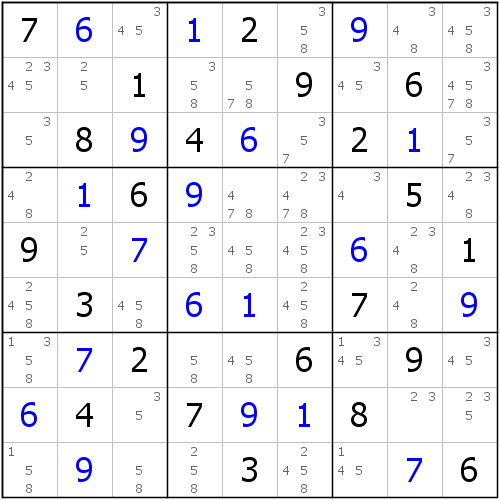
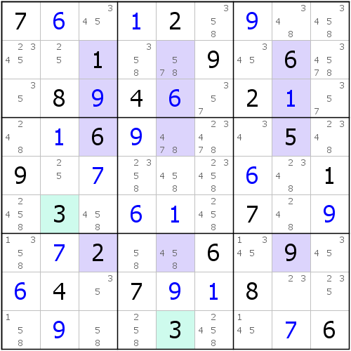
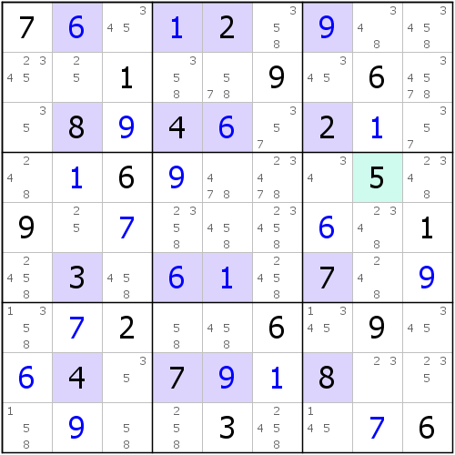
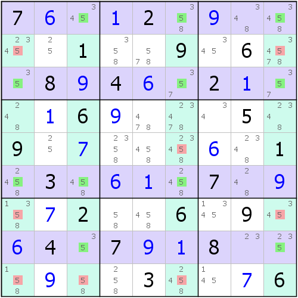
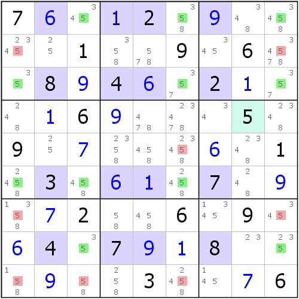

# 第 10 讲：鱼的观察

上一讲我们说到了鱼的基本推理思路，它们的变化非常多，可以是结构残缺，也可以是规格的变化。下面我们来给大家一个比较通俗易懂的描述来教大家如何去找它们。

## Part 1 用一个示例来表达我想说的东西



如图所示，由于链列只涉及同一个数字，所以我们的观察方法就是通过1到9逐个查找的方式来搜索是否这个数有普通链列和鳍链列结构。

为了解释我的逻辑，我们从1开始。首先我们把盘面里所有的1都圈出来，一共是7个。然后我们要找出一个矩形区域，这个矩形区域是任意的，随便你怎么选其中的单元格位置，只要它是一个矩形，而且我们的矩形涉及的所有单元格以及所处行列下都没有确定值1即可，且还要求矩形的所有单元格里不能有候选数1。不过，我们需要把矩形找到后，把矩形的信息代入这个公式：

```text
NAIN = 9 - (矩形行数 + 矩形列数)
```

**如果这个所谓的NAIN等于我们要找的这个数字出现的总个数的时候（此处指的是数字1的总个数），我们就可以称为该数存在鱼结构，并且鱼身就产生在矩形所在的行列上，而删数，则产生在矩形所在行列以外的其它任何位置上，并且，矩形所占行数和列数的较小者就是这个鱼结构的规格**。

对照例子给的图。我们要找的矩形必须是涉及一行一列的，因为带入公式，1的总个数是7个，而9 - 2 = 7，所以矩形行数加矩形列数必须是2才行，而一行一列代入公式：1 + 1 = 2，故需要找一行一列的矩形，也就是找一个单元格。而显然，从这个定理里，我们说过矩形行数和列数的较小者是鱼的规格，所以一行一列要是真能出现，说明鱼结构的规格是1，这在鱼里显然是不可能的（因为鱼的规格至少为2。当然了，如果你在找鱼结构之前，没有发现题上还存在“残留”的行列排除的话，那么按照这个定理去找东西，而且要是真的找到了，那么它就对应这个行列排除）。

试想一下，假如我们已经找全了当前盘面下给出的所有1的排除，说明我们连矩形规格的情况都不存在了，所以肯定不可能有1的鱼。所以我们继续找数字2。

数字2一共有三个确定值，这意味着，要想让NAIN值是3，就必须满足9 - 3 = 6，所以矩形一般需要找的是两行四列、三行三列和四行两列的，并且矩形所在的行列和矩形本身都不能含有数字2和任何的候选数2。实际上，你可以仔细寻找一下这种矩形，这个矩形你是找不到的，因为怎么找，始终都会包含一个候选数2的单元格。所以2看似也没有鱼结构，那么我们去看数字3。

数字3也是一样。数一下确定值个数：2个，所以公式9 - 7 = 2，我们需要找矩形行数和列数总和为7的结构（例如三行四列）。比如我给出一个错误示范：



例如这个例子就是错误的寻找方式。虽然这个矩形区域恰好是四行三列，代入公式是正确的（9 - \(4 + 3\) = 2），但是在矩形所在的行列里包含数字3的确定值，即此处的c5上。所以矩形是无效的，我们只得重新找。

遗憾的是，数字3确实没有我们想要的结构，所以只能去找数字4。

数字4的寻找我们就省略了，我们直接来看数字5（因为我可以明确地告诉你的是，数字5确实存在，而数字4不存在普通鱼，为了讲解不啰嗦，我们就跳过寻找过程了，逻辑和方式和上面的找1、2、3的方式完全是类似的）。

首先，我们发现全盘只有一个数字5的确定值，那么根据要求，我们需要寻找的是9 - 1 = 8的情况，即行数和列数之和要为8的矩形（比如四行四列）。只要我们能找到一个四行四列的区域，且这个矩形不包含候选数5或5的确定值，且涉及的行列也是的话，那么根据定理，我们就可以立马得到数字5存在一个普通的四链列结构。实际上，确实存在，如图所示。



可以看到这此时寻找的区域是四行四列的，并且单元格以及所处行列的任意位置都不包含数字5的确定值，而且矩形涉及的每一个单元格都是确定值（根本不包含候选数5），所以这个矩形是合格的。那么，我们根据定理可以得到，数字5存在一个四链列，且四链列产生在矩形所处行列上，而删数则产生在矩形行列都“扫”不到的地方。

实际上，这个鱼在这里（如左图所示），而如果你看着别扭，我们提供了普通视角（如右图所示）。




确实完全符合我们的预期，是一个很普通的四链列，而且结构的删数确实也都产生于矩形“扫”不到的地方。这种观察是不是很厉害呢？而且我们还可以从公式里得到一点：如果确定值有6个及其以上的时候，根据公式，我们需要找矩形行数和列数和为3的情况，但此时即使存在鱼，规格也是1，所以不符合要求。所以我们可以下结论：**存在鱼结构的数字在全盘的确定值不能超过5个**。5个就是极限情况，即只能出现二链列。

这种观察角度好在它基本上不关心候选数情况（很少关注候选数，也就是在找矩形的时候，矩形里不含该候选数的格子），这样我们只要去找不是5的数字，然后画个矩形就OK了，实际上这种观察很简单，而且效率很高，一般而言，如果经常找鱼结构的话，有经验了，寻找大概一分钟就能把1到9里所有数字都看一遍，而且能马上分辨出哪些数字有鱼结构，哪些数字没有。

总结一下，我们要找的矩形要满足如下规则：

1. 矩形的单元格里不能包含任何的该数的确定值；
2. 矩形涉及的单元格里不能存在有含有该数的候选数情况的单元格；
3. 矩形所属行列上的任意单元格都不含有该数的确定值；
4. 用9去减矩形的行数，再减列数为NAIN值，该值必须等于该数字的总确定值个数。

要是满足上述的所有要求的矩形，那么矩形就是合格的，且鱼结构存在。

## Part 2 为什么这个公式会奏效？它怎么就和鱼扯上关系了？



我们来说一下，为什么前面的这些要求可以让我们快速找到鱼。答案其实很简单。虽说我们找的是确定值，而且还跟数字5没关系，但是我们可以认真地发现，5的鱼出现在这个矩形的所在行或所在列上。比如上面这个图，5是在矩形的所在行r1368。那为什么会这样呢？

你仔细看全盘的确定值5，你就可以发现，5最多只能排除到c8，而这个矩形占据了一共4列。鱼的结构是n×n的，也就意味着结构会有4列，盘面一共是9列，抛开4列，还剩5列，再把前文5可以排除掉的c8除掉，刚好就剩下4列可以摆放一条鱼了。

所以，这就是为什么我们旁敲侧击地完成了对鱼的观察。鱼我们如果通过候选数来找的话，往往都是很困难的；但我们提供了这个视角后，鱼的寻找就会变得比较简单了。

