# 第 12 讲：带鱼鳍的鱼的观察

## Part 1 推导

鳍鱼和普通鱼的观察规则大部分相同，只有一点稍微不一样：**矩形内可以含有该数的候选数情况的单元格**（但是这样的单元格的个数是有限制的，具体什么限制我们将稍后提起）。我们来思考如下例子：

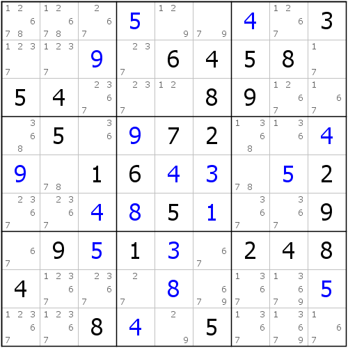

我们可以使用刚才的逻辑来寻找结构，并且矩形里可以含有该候选数的单元格了。那么我们依旧按照刚才的逻辑来寻找。寻找过程因为大部分都是相同的，所以找的过程我们就省略了，直接来看结论。如图所示。

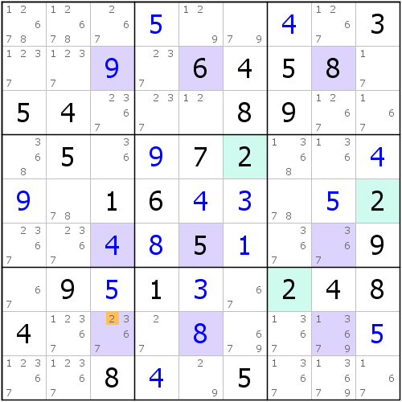

可以看到示例里，一共有3处2的确定值，那么我们找的结构必须是行数加列数为6的矩形，此处我们找的是三行三列的矩形，符合要求。

不过我们发现了r8c3是含有候选数2的，那么，我们就可以这么思考了：

* **如果r8c3 &lt;&gt; 2**，则矩形区域就不含任何的候选数2了，矩形成立，而且还印证了盘面一定存在关于2的普通的三链列；
* **如果r8c3 = 2**，则它只能影响到它的相关格的2（即只能删除r8c3相关格里的所有位置的候选数2）。

而我们可以从最开始的定理知道，普通鱼产生的删数在矩形所在行列外的其它位置，所以我们就可以得到一个结论了：最终这个鱼的可能删数就是{r79c1, r9c2}\(2\)了。当然了，r7c1不含有2，所以删数是r9c12\(2\)。而实际上，这条鳍鱼确实是存在的，而且也符合我们的预期。

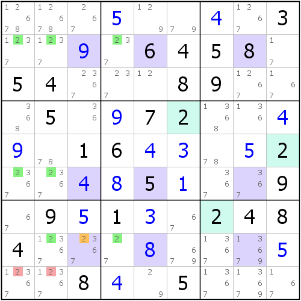

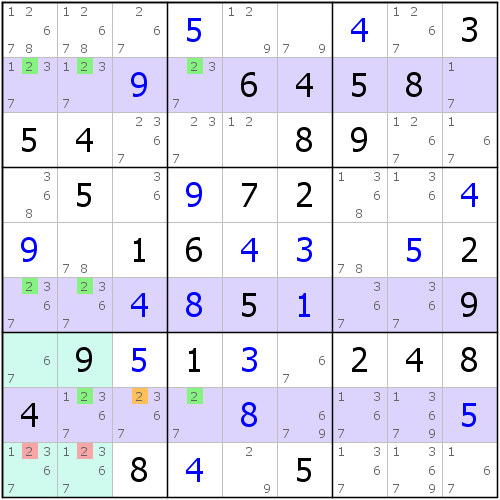

如图所示。是一个三阶鳍鱼。

那么我们可以了解到的是，实际上这个含有候选数2的矩形的单元格r8c3实际上最后被转换为了普通视角的鱼鳍，而鱼鳍在一般层面下是最多只能两个的（在孪生鱼里可能有最多有四个，例如之前的例子那样。不过孪生鱼最终是可以被拆解称两个一般的鳍鱼的，所以实际上还是只有最多两个鱼鳍）。所以，我们找的矩形里最好不要包含三处甚至更多的候选数的单元格，这样会带来很大的麻烦，而且两处包含该候选数的单元格最好同一个宫，这样才符合我们最开始提到的普通视角的鱼的删数逻辑。

那么观察鱼的内容我们讲到这里，我们最后整理并给出六则示例，提供给大家用来作参考和理解使用。

## Part 2 例子

这里陈列六个观察的示范示例，这些例子我们都没有给出普通视角的鱼到底是怎么画出来的，你可以尝试着寻找一下，并且自己把它们画出来。

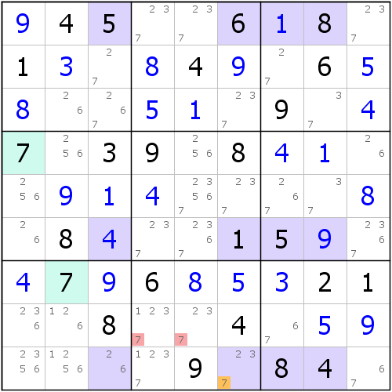

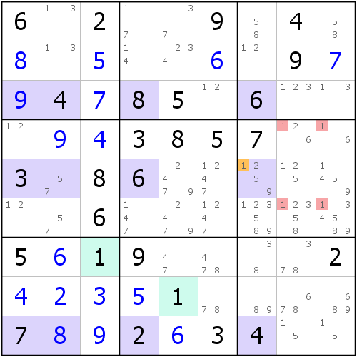

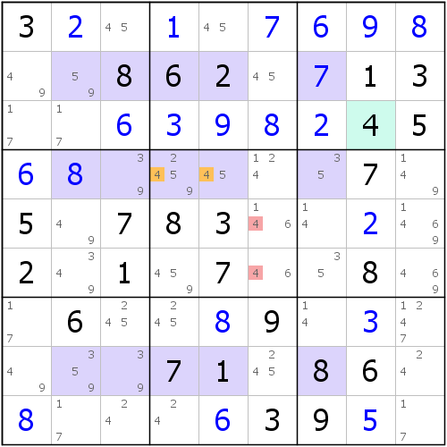

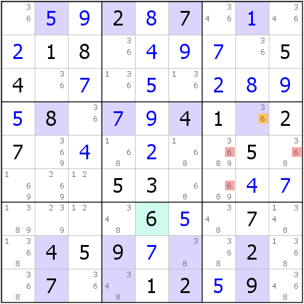

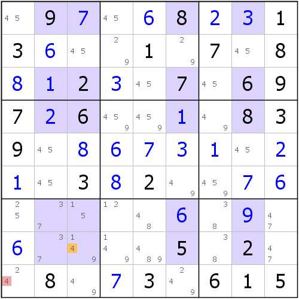

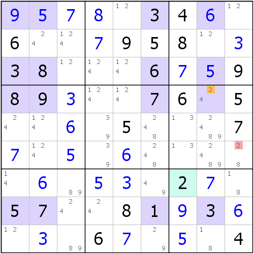

## Part 3 来一道练习题！

我们给出一个题目，这些题目只需要用到排除、唯一余数和本章给出的鱼技巧。慢慢享用吧！

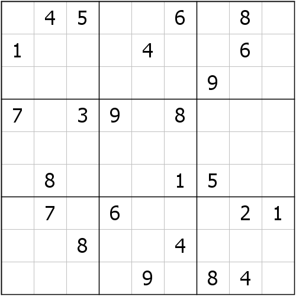

别看这个题连候选数都没有给你标注出来，实际上这个题使用了我们之前解释的观察技巧就可以发现，它实际上根本就用不上候选数。所以这题我也没有标注候选数，作为挑战，希望你加油。

## Part 4 再留一个问题

普通的鱼和去鳍鱼我们都讲了，那么这里留一个问题，希望你能够思考一下：既然我们把两种鱼的观察都讲了，那么你能从这个层面想一想，为什么这两种鱼是可以互补的吗？

