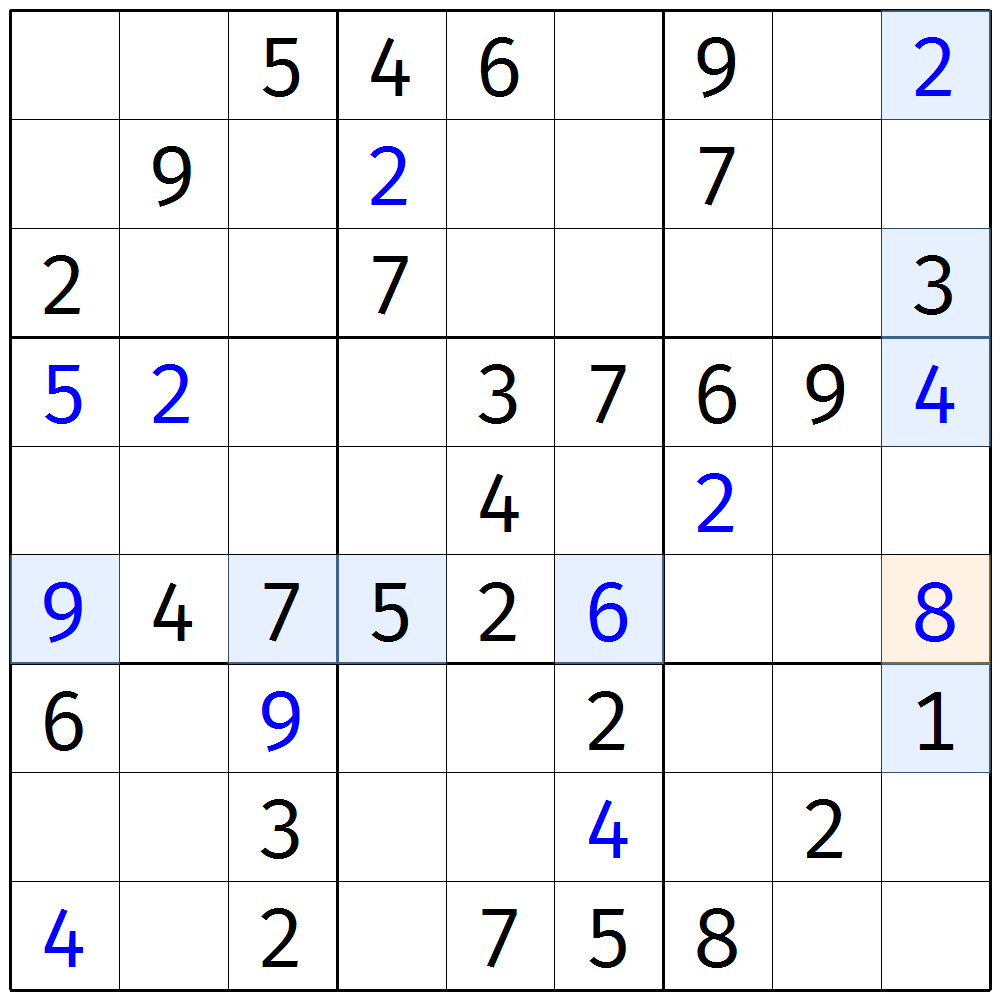
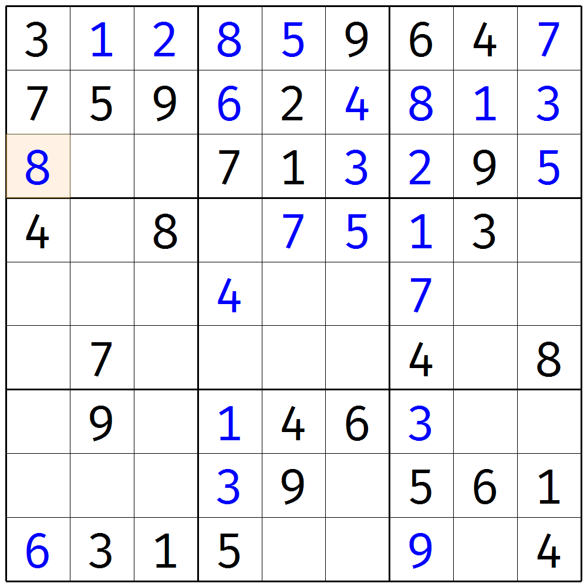
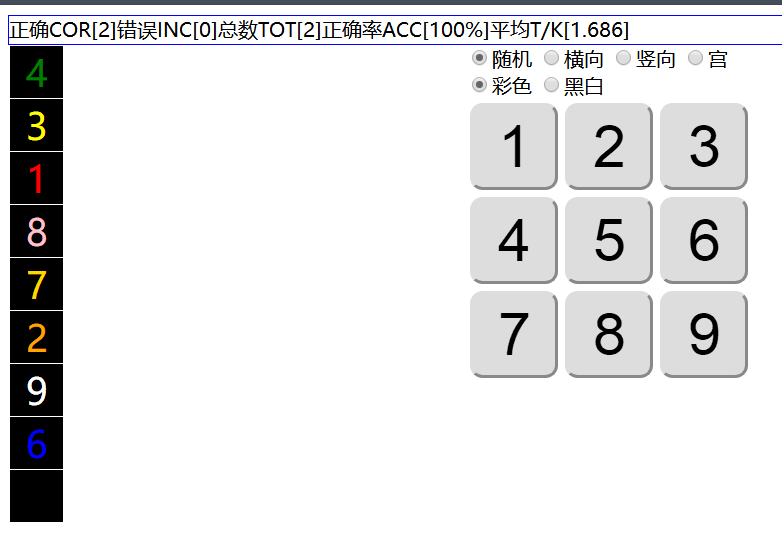

# 第 3 讲：唯一余数

和排除不同，**唯一余数**（简称**唯余**，**Naked Single**）这种技巧并非针对行、列、宫作排除，而相当于针对单元格作排除。

## Part 1 一则示例

如图所示，仔细观察r6c9一格。数数r6c9能填哪些数字。数字1不行，原因是r7c9是1；数字2不行，原因是r1c9是2（或者你看r5c7和r6c5也可以）；数字3不行（r3c9）、数字4不行（r4c9）、数字5不行（r6c4）、数字6不行（r4c7或r6c6）、数字7不行（r6c3）、数字9也不行（r4c1）。

那么，既然1、2、3、4、5、6、7、9都不行，那只能填8了，所以r6c9 = 8。这便是这个技巧所得到的结论。

注意，这个题目其实还有两处唯一余数技巧可以使用，请尝试找一下。

> 你是不是嫌讲解得太简单了？别着急，花式使用唯一余数的内容还在后头呢，所以唯一余数后面还会出现的。

## Part 2 怎么观察？

观察历来都是比较难受的东西，它一般都不能被好好地阐述出来，因为讲不清楚，所以这里介绍一种能方便解释也方便观察的折中的思维。

为了更好地说明清楚我想要告诉给你的东西，这里我再给出一个例子。

如图所示，请你先观察左图，如果把r3c1 = 8的结论去掉，你是否能看到它？

我的观察方式是这样的：由于宫排除更容易看到，所以我们着重去找宫内确定值比较多的宫，比如b16789这种。找这种宫有一个好处是，我们可以数数一下瞄到缺少的数字到底有哪些了，比如b1缺少的数字是4、6、8。那么我们就分别去看r3c123三格，每一个单元格都有能影响到它的一部分单元格，比如r3c1，r3、c1和b1里所有非r3c1的单元格都能影响到r3c1的填数。换而言之，这些单元格里任意一个单元格一旦出现了数字a，都会使得r3c1不能填入数字a。

明确这一点后，我们就针对r3c1、r3c2和r3c3三格，挨个都看一下它对应的这些单元格里，到底有没有可以排除的数字。比如r3c1的所在列（c1）里有数字4和6（如右图所示），这恰好能够排除掉4、6、8的其中两种情况，所以我们就能够很容易地得到结论r3c1 = 8了。而我们在观察的时候，也可以利用这一点，来观察唯一余数。

> 当然，我在前面说到“观察空格比较少的宫”，这一点只是一个经验，如果你做题有经验后，你可能就不会采用我这种笨办法了，而是一眼就能瞄到哪个单元格有哪些填数情况。所以这一点不绝对，仅供参考。
>
> 另外，刚才说到的能影响某一个单元格的所有单元格，有一个专门的说法叫做**相关格**（**Peers**/**Buddies**），每一个单元格都有20个相关格。

> 比如这个题目里，缺少的黑色空格是数字5。你就只需要对着屏幕按下数字5的按键就可以了。不管正确与否，它都会跳转到下一题，并且记录下你的正确情况。

“正确\[2\]”表示对两题，“错误\[0\]”表示错误0个题目；“总数\[2\]”表示做了两个题，“正确率\[100%\]”表示做题目前的正确率是100%，“平均\[1.686\]”表示每一题的平均耗时为1.686秒。

一般来说，我们需要练习到平均时间在1.2秒以下，唯一余数的观察能力就会比较强了。一般比赛的参赛选手的数数练习都在1秒内。

你还在等什么呢？快来练习吧！

## 技巧信息

* **唯一余数**：难度2.3。

## 名词解释

* **唯一余数**、**唯余**（**Naked Single**）：表示唯一余数这种技巧。
* **相关格**（**Peers**/**Buddies**）：某一个单元格所在的行、列、宫的其余单元格的统称。比如r1c1的相关单元格有r1c23456789、r23456789c1和r23c23，一共20个。每一个单元格都有20个相关单元格。

