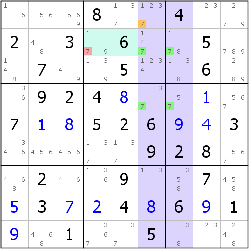
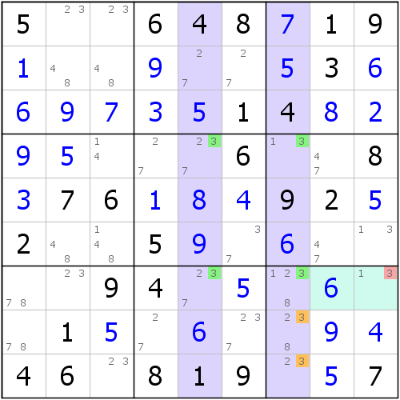
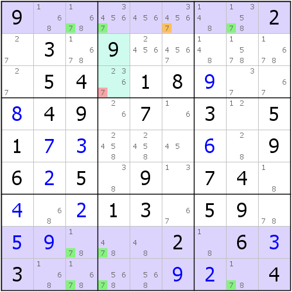
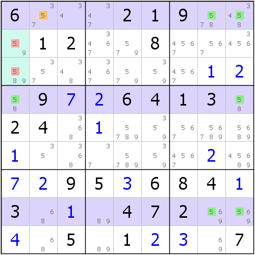
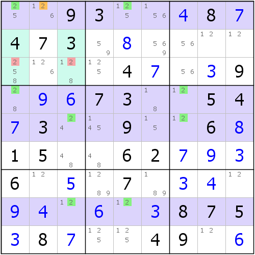
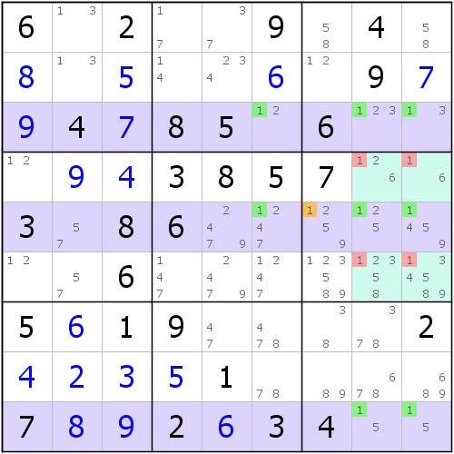
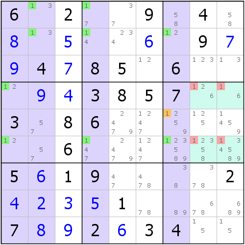

# 第 11 讲：鱼鳍（一）：普通的鱼鳍

之前我们说到了普通鱼结构，不过实际上我们并不可能经常出现类似于之前这样，刚好数字出现于几行几列的情况，有时候还是有点瑕疵的，所以我们现在就来探讨一下，如果鱼出现了瑕疵，又到底怎么用？

## Part 1 带鱼鳍的二阶鱼（Finned X-Wing）

如图所示，我们发现，对于c67来说，能够填入7的位置，只有五个单元格：r1c6和r24c67。其中，我们当r1c6不存在，那么剩余结构是什么？那肯定是我们最为完美的二阶鱼。但是r1c6的存在，使得现在不能完美地运用了。但是，我们可以这么去想：

* 当r1c6 = 7时：r1c6的相关格都不可以填7，因为但凡相关格的其一填入7，都会和r1c6它们共同所在的区域下出现重复数字；
* 当r1c6 &lt;&gt; 7时：二链列结构形成，所以删数应为r24c1234589。

只可能有上述两种情况的出现，但我们可以发现到的是，两种情况下，都可以删除掉r2c45\(7\)，所以，r2c45 &lt;&gt; 7。

> 这些瑕疵在鱼里称为鱼鳍（简称**鳍**，**Fin**），其中的r1c6\(7\)，我们就称为鳍。表示长在鱼身上，又要影响推导结果的候选数。
>
> 注意，英文名“**鳍鱼**（**Finned Fish**）”之中的“鳍”含义为“**带鳍的**（**Finned**）”，所以采用分词性形容词形式。
>
> 还有需要注意的地方是，当鱼鳍成立的时候，只需要讨论它能删除的位置，即它的相关格的数字，此时并不会去关注整体鱼身到底发生了如何的变化，因为最终的删数是看删除域和相关格的交集。

那么，如何能快速观察和推断到删数情况呢？你可以发现，r1c6的相关格组涉及三个区域：r1、c6、b2。r1和c6下，都不会和它不存在所形成的二链列的删除的单元格有任何的交集，而只有b2才有交集。所以，**鳍和剩余鱼结构（即鱼身）的删数交集只能是宫内**。

那么，鳍可以在一个技巧下存在几个呢？因为删除交集只能是宫内，所以最多也只能有2个。接下来我们来看一个有两个鱼鳍的例子。

如图所示，此时影响二阶鱼成立的一共有两个候选数：r89c7\(3\)，所以我们灵活处理这两个候选数，我们将r89c7\(3\)看作是一个区块。假设r89c7\(3\)两处都不填，或者是r89c7\(3\)里至少一处要填这样两种情况。

> 初学这里，我们来思考一下，为什么讨论的时候只分上述两种情况。如果r89c7两处都不填3，就好比这两个单元格“有0格填3”；而与之相反的情况则只可能是“至少1格填3”。这两种情况即所谓的数学表达“= 0”和“&gt; 0”（此时我们不需要讨论“&lt; 0”的情况，因为鱼鳍的总个数是不可能为负数值的）。

* 当r89c7都不是3：此时所有影响二阶鱼形成的位置都将不复存在，所以二链列此时成立，删数则是删除域上的3（当然鱼身所占的4格是不能删除3的，这里说的是抛开这四个单元格的其它位置）；
* 当r89c7里至少有一格填3：不论r8c7还是r9c7填3，它们形成列区块形式，且它们同处于一个宫里，所以该宫里其余位置都不能填入3。

整合了两大情况后，我们发现，此时不论哪种情况成立，r7c9\(3\)都是可以去掉的，所以r7c9\(3\)便成为了这个题目的删数。

这个例子里，运用了两个鱼鳍，也就是这里的r89c7\(3\)，不过这里，因为有两处鱼鳍，所以我们为了简化分类讨论的情况，我们将其合并归并为一种情况来讨论。

## Part 2 带鱼鳍的三阶鱼（Finned Swordfish）

接下来我们来看一则三阶的、带鱼鳍的普通鱼结构。

如图所示。如果r1c6\(7\)不存在，那么r189作为定义域，数字7就会出现三阶鱼结构，那么标准的删数就在c348里产生了。不过，当r1c6\(7\)的出现，使得我们不得不讨论r1c6 = 7的情况。当r1c6 = 7时，删除的数字就只有它的相关格里的7了。

合并两个情况，我们发现，它们都能删除掉的只有r3c4\(7\)，所以r3c4 &lt;&gt; 7。

我们再来看一则示例，这则示例可不太好理解。

如图所示，这个例子有些奇怪。如果r1c2 &lt;&gt; 5，你就会发现，这个例子和之前的例子都有所不同：鱼身处于c1里只有r4c1一格了。按照普通鱼的讨论逻辑，为了保证要放3个5，r4c1此时必须填5（否则的话，结构整体就只能放到r148c89这个矩形区域里，而这个3 \* 2的区域里是怎么都放不下三个5的。）所以必须得让r4c1 = 5。当然，前提是r1c2 &lt;&gt; 5，即鱼鳍不成立的时候，才有的结论。

那么我们此时就不必再去关注其余5的摆放位置了。因为我们讨论的两个核心情况已经出来了：鱼鳍不成立的时候，r4c1 = 5；鱼鳍成立的时候，r1c2 = 5。所以完全只需要去看r1c2和r4c1都能删除的地方，按照普通鱼和鱼鳍相关格的交集这一个层面来讨论的话，删除的仅有r23c1\(5\)。

> 好了，实际上这个题的删数并不止这些。而且我们从逻辑里就已经看出了端倪，只是在段落的描述里没有点破这一点。那么还有哪里可以删除呢？试试找一下吧。
>
> 另外，可以从描述里发现，如果鱼鳍不存在的话，这个结构实际上就降阶变为二阶鱼了（此时只需要看r18），所以这一点跟之前显隐性互补的其中一则示例是一样的，虽然是四数组，但我们可以降阶变为三数组。不过，这则示例之所以客观存在，还是因为这里的鱼鳍是客观存在的缘故，它使得结构存在而不会被降阶，毕竟鱼鳍本身也单独算作其中一种分析的情况来讨论。

## Part 3 带鱼鳍的四阶鱼（Finned Jellyfish）

我们先忽略r1c2\(2\)，看看在r1458上会发生什么神奇的事情。当我们忽略r1c2\(2\)时，r1458所有的2构成了四阶鱼结构，因为所有2均出现在r1458c1357这个矩形里，没有超出这个矩形，且这个矩形恰好是四行四列的，所以为了保证每一行都放下一个2，而且行列互不影响，所以必须在c1357上各放下一个2，才够放下4个2，于是四阶鱼成立。

当然，r1c2\(2\)是客观存在的，所以假设当r1c2 = 2的时候，只能删除掉删除域里r23c13\(2\)。所以，这便产生了删数r23c13\(2\)。

## Part 4 带鱼鳍的鱼的互补

有没有发现，在之前的示例里，依然没有出现规格大于4的、带鱼鳍的普通鱼结构。难道鳍鱼也拥有互补的情况？答案是，是的。不过，这一点的证明我们无法从现有的知识来得到，所以证明就不给出了，不过我们可以给出一个示例，让你能明白这一点。

如左图所示，可以看到它是一个很普通的三阶鳍鱼结构，不过，我们依然按照之前的方式，将关注点变为白色的单元格。只是，在转变视角后，选取的定义域要从行变为列，而且鱼鳍的位置依然不能发生任何改变。

确实，我们从白色的单元格里发现到了一处鳍鱼结构，此时鳍鱼是四阶的。不过需要你注意到的地方是，此时删除域r4上，只有一处1可以填上去。推理过程里要保证每一个删除域部分都得填入一个1才合适，所以此时r4的1仅能放置到r4c1上。这一点和之前讲到的三阶鳍鱼的后面这一则示例很相似。不过，删除的数字依然没有发生变动。

## 技巧信息

* **鳍二阶鱼**：难度3.4。
* **鳍三阶鱼**：难度4.0。
* **鳍四阶鱼**：难度5.4。

> 其他更高阶的鱼可以互补成低阶鱼，所以难度不作分析。

## 名词解释

* **鱼鳍**（**Fin**）：表示影响推导的鱼外部的一部分。当鱼鳍为假的时候，鱼才会成立；所以删除鱼鳍所在行列宫，以及鱼本身删除域的交集。

